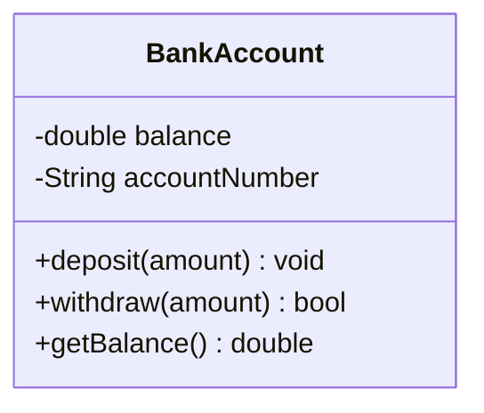
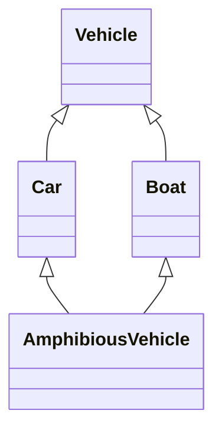
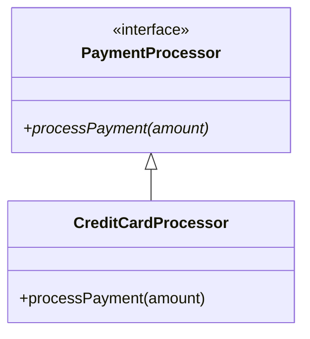

# 01 - Object-Oriented Programming (OOP) Foundations & Modern C++ Mechanics

Mastering Low-Level Design (LLD) starts with deep fluency in Object-Oriented Programming (OOP) fundamentals and understanding the underlying C++ object model, memory layout, and Modern C++ language mechanics.

We have combined all **25 Core Topics** into this guide. **Every topic is explained separately with its own code!**

---

## 🏛️ The 4 Pillars of Object-Oriented Programming (OOP)
Before diving into the code, you must understand the 4 core concepts (pillars) of OOP. Every software design pattern is built on these!

1. **Encapsulation (Data Hiding):** Bundling data (variables) and the methods that operate on them into a single unit (a class). Most importantly, it involves keeping the data private so outside code can't accidentally break it. *(Covered in Section 1)*
2. **Abstraction (Simplicity):** Hiding the complex, hard-to-understand internal details of a system and only showing a simple interface to the user. Like driving a car—you use the steering wheel without needing to understand the internal combustion engine. *(Covered in Section 4)*
3. **Inheritance (Reusability):** Allowing a new class to inherit properties and behaviors from an existing class. It creates an "IS-A" relationship (e.g., a `Dog` IS-A `Animal`). *(Covered in Section 3)*
4. **Polymorphism (Many Forms):** The ability of different objects to respond to the exact same function call in their own unique way. (e.g., calling `draw()` on a `Circle` draws a circle, but calling `draw()` on a `Square` draws a square). *(Covered in Section 4)*

---

## Section 1: Classes, Objects, Access Modifiers, and Encapsulation

### Topic 01: Classes and Objects
A **Class** is a blueprint or template that defines properties (data) and behaviors (methods). It does not take up memory on its own.
An **Object** is a real, runtime instance of a class. When an object is created, the system allocates memory for it based on the class blueprint.

**Code Example:**
```cpp
#include <iostream>
#include <string>

// This is the blueprint (Class)
// Yeh blueprint (Class) hai
class Car {
public:
    std::string color;
    void drive() {
        std::cout << "Driving the " << color << " car.\n";
    }
};

int main() {
    // This is the actual object taking up memory
    // Yeh actual object hai jo memory le raha hai
    Car myCar;
    myCar.color = "Red";
    myCar.drive();
    return 0;
}
```

### Topic 02: Access Modifiers
Access modifiers define the boundaries of your objects. They restrict who can see and modify the data.
- `public`: Accessible from anywhere in the program.
- `private`: Accessible only from within the class itself. It protects the data from unauthorized changes.
- `protected`: Accessible from within the class and its derived (child) classes.

**Code Example:**
```cpp
#include <iostream>
#include <string>

class SecretVault {
private:
    // Only the class can see this
    // Sirf class hi isko dekh sakti hai
    int secretCode = 1234;

protected:
    // Children classes can see this
    // Bachhe (child classes) isko dekh sakte hain
    int familySecret = 5678;

public:
    // Anyone can see this
    // Koi bhi isko dekh sakta hai
    std::string vaultName = "Main Vault";
    
    void showSecret() {
        // Class can access its own private data
        // Class apna private data access kar sakti hai
        std::cout << "Secret is: " << secretCode << "\n";
    }
};
```

### Topic 03: Encapsulation & Data Hiding
**Encapsulation** is the act of bundling data and the methods that operate on that data into a single unit (the class).
**Data Hiding** is achieved by making the data `private`. This ensures that the internal state cannot be corrupted by external code. External code must use `public` methods (getters and setters) to interact with the object safely.

**UML Diagram:**

*(Note: `-` means private, `+` means public)*

**Code Example:**
```cpp
#include <iostream>
#include <string>

class BankAccount {
private: 
    // Data Hiding: Nobody can change it from outside directly
    // Data Hiding: Koi bahar se ise direct change nahi kar sakta
    double balance;
    std::string accountNumber;

public:
    BankAccount(std::string accNum, double initialBalance) 
        : accountNumber(accNum), balance(initialBalance) {} 

    // Controlled access to modify data
    // Data modify karne ka safe tareeka
    void deposit(double amount) {
        if (amount > 0) {
            balance += amount; 
        }
    }

    // Controlled access to read data
    // Data read karne ka safe tareeka
    double getBalance() const { return balance; }
};
```

### 🎯 Practice Coding Challenges (Section 1)
**Challenge 1: Design a `Temperature` class**
- **Goal:** Practice Encapsulation (Data Hiding).
- **Task:** 
  - Create a class that stores temperature in Kelvin as a `private` variable.
  - Create `public` methods to Get and Set the temperature in Celsius, Fahrenheit, and Kelvin.
  - **Rule:** Do not allow anyone to set a temperature below 0 Kelvin (Absolute Zero).

**Challenge 2: Padding Inspection**
- **Goal:** Understand Memory Layout.
- **Task:** 
  - Create three different `struct`s:
    1. An empty struct.
    2. A struct with a `char` followed by a `double`.
    3. A struct with a `double` followed by a `char`.
  - Print their sizes using `sizeof()` and observe how C++ adds hidden memory padding.

**Challenge 3: Encapsulation Refactoring**
- **Goal:** Fix bad code.
- **Task:** 
  - Imagine a bad class that has `public int accountBalance`. 
  - Change it so the balance is `private`.
  - Add safe public methods like `deposit(amount)`, `withdraw(amount)`, and `transfer(amount)`.

---

## Section 2: Object Lifecycle - Constructors, Destructors, and Copy Semantics

### Topic 04: Constructors & Destructors
**Constructors** are special functions called automatically when an object is created. They initialize the object's memory.
**Destructors** are called automatically when an object goes out of scope or is deleted. They are critical for cleaning up resources (like memory, files, or network connections) to prevent leaks. This concept is known in C++ as RAII (Resource Acquisition Is Initialization).

**Code Example:**
```cpp
#include <iostream>

class DatabaseConnection {
public:
    // Constructor
    // Jab object banega, tab yeh call hoga
    DatabaseConnection() {
        std::cout << "Connecting to Database...\n";
    }
    
    // Destructor (always starts with ~)
    // Jab object khatam hoga, tab yeh call hoga
    ~DatabaseConnection() {
        std::cout << "Closing Database Connection!\n";
    }
};
```

### Topic 05: Copy Constructor & Deep Copy
When you create a new object as a copy of an existing object, the **Copy Constructor** is called. 
By default, C++ does a "shallow copy" (just copies memory addresses). If your object manages heap memory (using `new`), a shallow copy will result in two objects pointing to the same memory, causing a "double-free" crash when they are destroyed. You must write a custom copy constructor to perform a **Deep Copy** (allocating new memory for the copy).

**Code Example:**
```cpp
#include <iostream>

class IntArray {
private:
    int* data;
public:
    IntArray(int value) {
        data = new int(value);
    }
    
    // Deep Copy Constructor
    // Deep Copy Constructor (Nayi memory allocate karta hai)
    IntArray(const IntArray& other) {
        data = new int(*(other.data)); // Copying the actual value, not the address!
    }
    
    ~IntArray() {
        delete data;
    }
};
```

### Topic 06: Copy Assignment Operator
This is called when you assign an already existing object to another existing object (`a = b;`). Similar to the copy constructor, you must implement this manually if your class manages raw memory, taking care to free existing memory before copying the new data.

**Code Example:**
```cpp
#include <iostream>

class FileHandler {
private:
    int* fileID;
public:
    FileHandler(int id) { fileID = new int(id); }
    
    // Copy Assignment Operator
    // Copy Assignment Operator
    FileHandler& operator=(const FileHandler& other) {
        // Prevent self-assignment (a = a)
        // Khud ko assign hone se rokna (a = a)
        if (this != &other) {
            delete fileID; // Delete old data
            fileID = new int(*(other.fileID)); // Allocate new data
        }
        return *this;
    }
    
    ~FileHandler() { delete fileID; }
};
```

### Topic 07: Move Semantics (Rule of 5)
Move semantics allow you to "steal" resources from a temporary object instead of doing an expensive deep copy. This introduces the Move Constructor and Move Assignment Operator, completing the "Rule of 5".

**Code Example:**
```cpp
#include <iostream>

class HeavyResource {
private:
    int* largeData;
public:
    HeavyResource() { largeData = new int[1000]; }
    
    // Move Constructor (Steals the pointer!)
    // Move Constructor (Pointer chura leta hai!)
    HeavyResource(HeavyResource&& other) noexcept {
        largeData = other.largeData; // Steal the data
        other.largeData = nullptr;   // Leave the old object empty
    }
    
    ~HeavyResource() { delete[] largeData; }
};
```

### 🎯 Practice Coding Challenges (Section 2)
**Challenge 1: Implement a Custom `DynamicArray` Class**
- **Goal:** Learn how to manage raw heap memory.
- **Task:** 
  - Create a class that manages an integer array using `new`.
  - Implement the **Rule of 3** (Destructor, Copy Constructor, Copy Assignment Operator).
  - Ensure you don't get "double-free" errors when copying objects!

**Challenge 2: Move Semantics (Rule of 5)**
- **Goal:** Learn how to steal resources for performance.
- **Task:** 
  - Extend your `DynamicArray` class.
  - Add a **Move Constructor** and **Move Assignment Operator**.
  - Show how you can swap ownership of the array without allocating new memory.

---

## Section 3: Inheritance Patterns

### Topic 08: Inheritance Basics (IS-A)
Inheritance allows a new class (derived) to take on the properties and behaviors of an existing class (base). It represents an **IS-A** relationship (e.g., a Dog IS-A Animal).

**Code Example:**
```cpp
#include <iostream>

class Animal {
public:
    void eat() { std::cout << "Eating...\n"; }
};

// Dog IS-A Animal
// Dog ek Animal hai
class Dog : public Animal {
public:
    void bark() { std::cout << "Woof!\n"; }
};
```

### Topic 09: Single & Multilevel Inheritance
- **Single Inheritance**: One base class, one derived class.
- **Multilevel Inheritance**: A chain of inheritance (A -> B -> C).

**Code Example:**
```cpp
#include <iostream>

class Grandfather {
public:
    void house() { std::cout << "Has a House.\n"; }
};

// Single Inheritance
class Father : public Grandfather {};

// Multilevel Inheritance (Son gets Father and Grandfather's traits)
// Multilevel Inheritance (Son ko dono ki properties milti hain)
class Son : public Father {};
```

### Topic 10: Hierarchical Inheritance
One base class is inherited by multiple derived classes (e.g., `Shape` is the base for `Circle` and `Square`).

**Code Example:**
```cpp
#include <iostream>

class Shape {
public:
    void print() { std::cout << "I am a shape.\n"; }
};

// Hierarchical: Multiple children sharing one parent
// Hierarchical: Ek parent, bohot saare bachhe
class Circle : public Shape {};
class Square : public Shape {};
```

### Topic 11: Multiple Inheritance
A class can inherit from more than one base class at the same time. This is powerful but can lead to ambiguity.

**Code Example:**
```cpp
#include <iostream>

class Camera {
public:
    void takePhoto() { std::cout << "Click!\n"; }
};

class Phone {
public:
    void makeCall() { std::cout << "Ring Ring!\n"; }
};

// Multiple Inheritance: Smartphone is BOTH a Camera and a Phone
// Multiple Inheritance: Smartphone Camera bhi hai aur Phone bhi
class SmartPhone : public Camera, public Phone {};
```

### Topic 12: The Diamond Problem & Virtual Inheritance
When a class inherits from two classes that share a common grandparent, it gets two copies of the grandparent's data. This is the **Diamond Problem**. C++ solves this using **Virtual Inheritance**, which ensures only one subobject of the grandparent is created.

**UML Diagram (Diamond Problem)**


**Code Example:**
```cpp
#include <iostream>

class Vehicle {
public:
    Vehicle() { std::cout << "Vehicle Created\n"; }
};

// Virtual inheritance ensures only ONE copy of Vehicle is created in memory 
// Virtual inheritance: Yeh ensure karega ki Vehicle ki sirf ek hi copy bane 
class Car : virtual public Vehicle {};
class Boat : virtual public Vehicle {};

class AmphibiousVehicle : public Car, public Boat {};
```

### 🎯 Practice Coding Challenges (Section 3)
**Challenge 1: Diamond Problem Code**
- **Goal:** Solve the Diamond Problem using Virtual Inheritance.
- **Task:** 
  - Create this hierarchy: `Device` (Base) -> `Printer` and `Scanner` -> `Copier` (Derived from both).
  - Use `virtual` inheritance so that only one `Device` is created in memory when you create a `Copier`.

---

## Section 4: Polymorphism, Virtual Functions, and Abstraction

### Topic 13: Compile-Time Polymorphism
Achieved using method overloading and templates. The compiler decides which function to call before the program even runs. It is extremely fast with zero runtime overhead.

**Code Example:**
```cpp
#include <iostream>

class MathHelper {
public:
    // Overloading: Same function name, different parameters
    // Overloading: Same naam, par alag parameters
    int add(int a, int b) { return a + b; }
    double add(double a, double b) { return a + b; }
};
```

### Topic 14: Runtime Polymorphism
Achieved using **Virtual Functions**. The decision of which function to call is made while the program is running, based on the actual object type, not the pointer type.

**Code Example:**
```cpp
#include <iostream>

class Base {
public:
    virtual void show() { std::cout << "Base class\n"; }
};

class Derived : public Base {
public:
    void show() override { std::cout << "Derived class\n"; }
};
```

### Topic 15: Vtable and Vptr
When a class has virtual functions, the compiler creates a hidden table of function pointers (Vtable) and adds a hidden pointer (Vptr) to the object. This is how runtime polymorphism works under the hood.

### Topic 16: Abstract Classes
An abstract class is a class that is meant to be inherited from, but cannot be instantiated directly. It serves as a generic blueprint.

### Topic 17: Pure Virtual Functions & Interfaces
A pure virtual function (written as `= 0`) forces derived classes to provide their own implementation. A class with only pure virtual functions and no data members acts as an **Interface** in C++.

**UML Diagram (Abstract Interface)**


**Code Example:**
```cpp
#include <iostream>

// Interface
class PaymentProcessor {
public:
    virtual ~PaymentProcessor() = default; 
    // Pure virtual function
    // Child class ko yeh function banani hi padegi
    virtual void processPayment(double amount) = 0; 
};

class CreditCardProcessor : public PaymentProcessor {
public:
    void processPayment(double amount) override {
        std::cout << "Credit Card payment of $" << amount << "\n";
    }
};
```

### 🎯 Practice Coding Challenges (Section 4)
**Challenge 1: Payment Gateway Abstraction**
- **Goal:** Use Runtime Polymorphism.
- **Task:** 
  - Create an abstract interface `PaymentStrategy` with a `pay(amount)` method.
  - Implement two child classes: `StripePayment` and `PayPalPayment`.

---

## Section 5: Overloading - Functions and Operators

### Topic 18: Function Overloading
Creating multiple functions with the exact same name, but with different parameters. (Already covered via Code Example in Topic 13).

### Topic 19: Operator Overloading
Giving custom meaning to C++ operators (like `+`, `==`, or `<<`) so they can work seamlessly with your own user-defined classes.

**Code Example:**
```cpp
#include <iostream>

class Vector2D {
public:
    float x, y;
    Vector2D(float x = 0, float y = 0) : x(x), y(y) {}

    // Operator Overloading (+)
    // '+' sign ko sikhana ki object kaise add karein
    Vector2D operator+(const Vector2D& other) const {
        return Vector2D(this->x + other.x, this->y + other.y);
    }
};
```

### 🎯 Practice Coding Challenges (Section 5)
**Challenge 1: Matrix Operator Overloading**
- **Goal:** Overload the `+` and `*` math operators.
- **Task:** Write a `Matrix2x2` class. Overload the `+` operator so you can do `matrix3 = matrix1 + matrix2`.

---

## Section 6: Object Relationships & Design Choices

### Topic 20: Inheritance (IS-A)
A Dog *is an* Animal. This creates very tight coupling between classes and should be used carefully. (Covered in Topic 8).

### Topic 21: Composition (Strong HAS-A)
A Car *has an* Engine. The Engine's lifecycle is strictly bound to the Car. If the Car is destroyed, the Engine is destroyed.

**Code Example:**
```cpp
class Engine {};
class Car {
private:
    // Composition: Engine dies with Car
    // Composition: Car maregi toh Engine bhi marega
    Engine engine; 
};
```

### Topic 22: Aggregation (Weak HAS-A)
A University *has* Professors. The Professor exists independently of the University.

**Code Example:**
```cpp
#include <vector>
#include <memory>

class Teacher {};
class Department {
private:
    // Aggregation: Department just holds a reference
    // Aggregation: Sirf reference hold kar raha hai
    std::vector<std::shared_ptr<Teacher>> teachers; 
};
```

### Topic 23: Association (USES-A)
A Patient and a Doctor. They communicate and interact, but neither owns the other.

### Topic 24: Dependency
Class A uses Class B locally (e.g., passed as a parameter in a method). It's a temporary relationship.

### Topic 25: Composition Over Inheritance
**Key Principle**: Favor Composition over Inheritance. Inheritance creates rigid, tightly coupled hierarchies. Composition creates flexible systems where behaviors can be swapped out at runtime easily.

### 🎯 Practice Coding Challenges (Section 6)
**Challenge 1: Composition vs Inheritance**
- **Goal:** Learn why Composition is safer than Inheritance.
- **Task:** Build a `Stack` class using a private `ArrayList` inside it (Composition) rather than inheriting from it.
