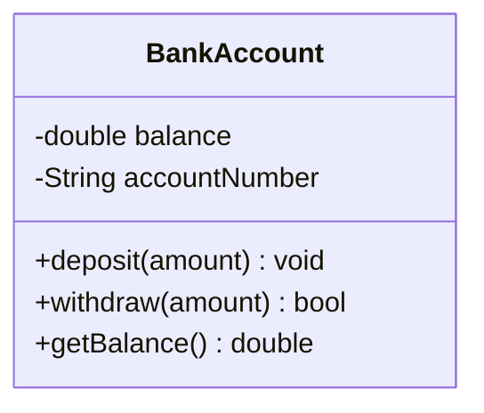
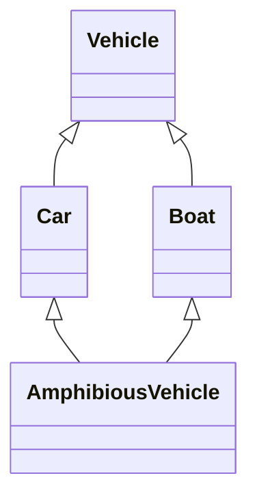
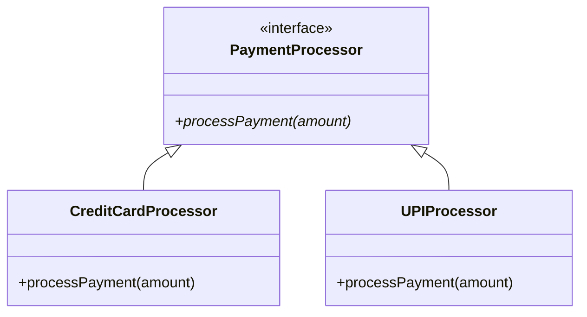
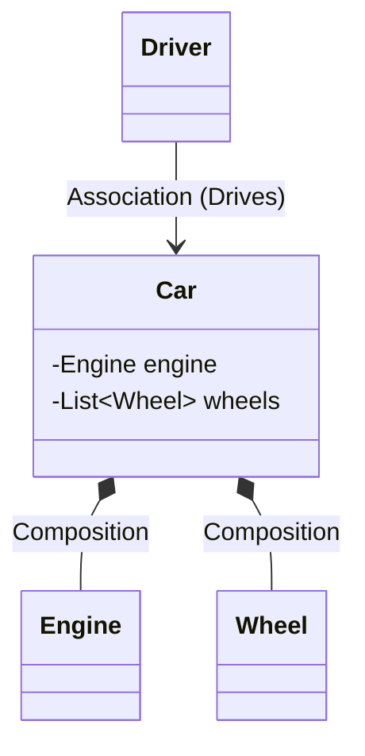

# 01 - Object-Oriented Programming (OOP) Foundations & Modern C++ Mechanics

Mastering Low-Level Design (LLD) starts with deep fluency in Object-Oriented Programming (OOP) fundamentals and understanding the underlying C++ object model, memory layout, and Modern C++ language mechanics.

We have combined all **25 Core Topics** into this single, easy-to-read guide. This features simple **Hinglish comments** in the C++ code, Mermaid diagrams, and hands-on coding challenges! easy simple way

---

## Section 1: Classes, Objects, Access Modifiers, and Encapsulation

### Topic 01: Classes and Objects
A **Class** is a blueprint or template that defines properties (data) and behaviors (methods). It does not take up memory on its own.
An **Object** is a real, runtime instance of a class. When an object is created, the system allocates memory for it based on the class blueprint.

### Topic 02: Access Modifiers
Access modifiers define the boundaries of your objects. They restrict who can see and modify the data.
- `public`: Accessible from anywhere in the program.
- `private`: Accessible only from within the class itself. It protects the data from unauthorized changes.
- `protected`: Accessible from within the class and its derived (child) classes.

### Topic 03: Encapsulation & Data Hiding
**Encapsulation** is the act of bundling data and the methods that operate on that data into a single unit (the class).
**Data Hiding** is achieved by making the data `private`. This ensures that the internal state cannot be corrupted by external code. External code must use `public` methods (getters and setters) to interact with the object safely.

### UML Diagram

*(Note: `-` means private, `+` means public, `#` would mean protected)*

### Code Example
```cpp
#include <iostream>
#include <string>

class BankAccount {
private: 
    // This data is private, nobody can change it from outside (Data Hiding)
    // Yeh data private hai, koi bahar se change nahi kar sakta (Data Hiding)
    double balance;
    std::string accountNumber;

public:
    // Constructor: This is called when the object is created
    // Constructor: Jab object banega, tab yeh call hoga
    BankAccount(std::string accNum, double initialBalance) 
        : accountNumber(accNum), balance(initialBalance) {} 

    // Deposit function: Used to add money
    // Deposit function: Paise add karne ke liye
    void deposit(double amount) {
        if (amount > 0) {
            // Only a valid amount will be added
            // Sirf valid amount hi add hoga
            balance += amount; 
        }
    }

    // Withdraw function: Used to take out money
    // Withdraw function: Paise nikalne ke liye
    bool withdraw(double amount) {
        if (amount > 0 && balance >= amount) {
            // Money is deducted only if the balance is enough
            // Agar balance enough hai, tabhi minus hoga
            balance -= amount; 
            return true;
        }
        return false;
    }

    // Getter: Used to read the data from outside
    // Getter: Bahar data read karne ke liye
    double getBalance() const { return balance; }
};

int main() {
    // The object is being created here
    // Yahan pe object create ho raha hai
    BankAccount account("ACC123", 1000.0); 
    
    // Calling the object's method
    // Object ke method ko call kiya
    account.deposit(500); 
    std::cout << "Balance: " << account.getBalance() << "\n";
    return 0;
}
```

### 🎯 Practice Coding Challenges

**Challenge 1: Design a `Temperature` class**
- **Goal:** Practice Encapsulation (Data Hiding).
- **Task:** 
  - Create a class that stores temperature in Kelvin as a `private` variable.
  - Create `public` methods to Get and Set the temperature in Celsius, Fahrenheit, and Kelvin.
  - **Rule:** Do not allow anyone to set a temperature below 0 Kelvin (Absolute Zero).

**Challenge 2: Padding Inspection**
- **Goal:** Understand Memory Layout.
- **Task:** 
  - Create three different `struct`s:
    1. An empty struct.
    2. A struct with a `char` followed by a `double`.
    3. A struct with a `double` followed by a `char`.
  - Print their sizes using `sizeof()` and observe how C++ adds hidden memory padding.

**Challenge 3: Encapsulation Refactoring**
- **Goal:** Fix bad code.
- **Task:** 
  - Imagine a bad class that has `public int accountBalance`. 
  - Change it so the balance is `private`.
  - Add safe public methods like `deposit(amount)`, `withdraw(amount)`, and `transfer(amount)` that check if the amount is valid before changing the balance.

---

## Section 2: Object Lifecycle - Constructors, Destructors, and Copy Semantics

### Topic 04: Constructors & Destructors
**Constructors** are special functions called automatically when an object is created. They initialize the object's memory.
**Destructors** are called automatically when an object goes out of scope or is deleted. They are critical for cleaning up resources (like memory, files, or network connections) to prevent leaks. This concept is known in C++ as RAII (Resource Acquisition Is Initialization).

### Topic 05: Copy Constructor & Deep Copy
When you create a new object as a copy of an existing object, the **Copy Constructor** is called. 
By default, C++ does a "shallow copy" (just copies memory addresses). If your object manages heap memory (using `new`), a shallow copy will result in two objects pointing to the same memory, causing a "double-free" crash when they are destroyed. You must write a custom copy constructor to perform a **Deep Copy** (allocating new memory for the copy).

### Topic 06: Copy Assignment Operator
This is called when you assign an already existing object to another existing object (`a = b;`). Similar to the copy constructor, you must implement this manually if your class manages raw memory, taking care to free existing memory before copying the new data.

### Topic 07: Move Semantics (Rule of 5)
Move semantics allow you to "steal" resources from a temporary object instead of doing an expensive deep copy. This introduces the Move Constructor and Move Assignment Operator, completing the "Rule of 5".

### Code Example (Deep Copy & Rule of 3)
```cpp
#include <iostream>
#include <cstring>

class StringWrapper {
private:
    // Pointer to heap memory
    // Heap memory pointer
    char* data; 
    size_t length;

public:
    // Constructor: Allocates new string memory
    // Constructor: Nayi string allocate karta hai
    StringWrapper(const char* str) {
        length = std::strlen(str);
        
        // Allocated new memory
        // Nayi memory li
        data = new char[length + 1]; 
        std::strcpy(data, str);
    }

    // 1. Copy Constructor (Deep Copy)
    // If we don't write this, a shallow copy happens and both objects point to the same memory (Double free error!)
    // Agar hum yeh na banayein, toh default shallow copy hoga aur do object same memory point karenge (Double free error!)
    StringWrapper(const StringWrapper& other) {
        length = other.length;
        
        // Allocated separate new memory
        // Alag se nayi memory allocate ki
        data = new char[length + 1]; 
        std::strcpy(data, other.data);
    }

    // 2. Copy Assignment Operator
    StringWrapper& operator=(const StringWrapper& other) {
        // First check if we are assigning to itself (obj = obj)
        // Pehle check karo ki khud ko assign toh nahi kar rahe (obj = obj)
        if (this != &other) { 
            // Free the old memory
            // Puraani memory free karo
            delete[] data; 
            
            length = other.length;
            
            // Create a new copy
            // Nayi copy banayi
            data = new char[length + 1]; 
            std::strcpy(data, other.data);
        }
        return *this;
    }

    // 3. Destructor: To prevent memory leaks
    // Destructor: Memory leak se bachne ke liye
    ~StringWrapper() {
        // Memory is released as soon as the object is deleted
        // Object delete hote hi memory release ho jayegi
        delete[] data; 
    }

    void print() const { std::cout << data << "\n"; }
};
```

### 🎯 Practice Coding Challenges

**Challenge 1: Implement a Custom `DynamicArray` Class**
- **Goal:** Learn how to manage raw heap memory.
- **Task:** 
  - Create a class that manages an integer array using `new`.
  - Implement the **Rule of 3** (Destructor, Copy Constructor, Copy Assignment Operator).
  - Ensure you don't get "double-free" errors when copying objects!

**Challenge 2: Move Semantics (Rule of 5)**
- **Goal:** Learn how to steal resources for performance.
- **Task:** 
  - Extend your `DynamicArray` class.
  - Add a **Move Constructor** and **Move Assignment Operator**.
  - Show how you can swap ownership of the array without allocating new memory.

**Challenge 3: Initialization Lists**
- **Goal:** Properly initialize `const` and `reference` variables.
- **Task:** 
  - Write a class `DatabaseConnection`.
  - It should contain `const std::string connectionString` and `int& port`.
  - Write a constructor that uses an **Initializer List** to set these variables (since they cannot be assigned inside the `{}` body).

---

## Section 3: Inheritance Patterns

### Topic 08: Inheritance Basics (IS-A)
Inheritance allows a new class (derived) to take on the properties and behaviors of an existing class (base). It represents an **IS-A** relationship (e.g., a Dog IS-A Animal).

### Topic 09: Single & Multilevel Inheritance
- **Single Inheritance**: One base class, one derived class.
- **Multilevel Inheritance**: A chain of inheritance (A -> B -> C).

### Topic 10: Hierarchical Inheritance
One base class is inherited by multiple derived classes (e.g., `Shape` is the base for `Circle` and `Square`).

### Topic 11: Multiple Inheritance
A class can inherit from more than one base class at the same time. This is powerful but can lead to ambiguity.

### Topic 12: The Diamond Problem & Virtual Inheritance
When a class inherits from two classes that share a common grandparent, it gets two copies of the grandparent's data. This is the **Diamond Problem**. C++ solves this using **Virtual Inheritance**, which ensures only one subobject of the grandparent is created.

### UML Diagram (Diamond Problem)


### Code Example (Solving the Diamond Problem)
```cpp
#include <iostream>

class Vehicle {
public:
    Vehicle() { std::cout << "Vehicle Created\n"; }
    virtual ~Vehicle() = default;
};

// Virtual inheritance ensures only ONE copy of Vehicle is created in memory (Solves Diamond problem!)
// Virtual inheritance: Yeh ensure karega ki Vehicle ki sirf ek hi copy bane memory mein (Diamond problem solve!)
class Car : virtual public Vehicle {
public:
    Car() { std::cout << "Car Created\n"; }
};

// Same here, Boat is also using virtual inheritance
// Same yahan, Boat bhi virtual inheritance use kar raha hai
class Boat : virtual public Vehicle {
public:
    Boat() { std::cout << "Boat Created\n"; }
};

// AmphibiousVehicle inherits from both Car and Boat
// AmphibiousVehicle Car aur Boat dono se inherit kar raha hai
class AmphibiousVehicle : public Car, public Boat {
public:
    AmphibiousVehicle() { std::cout << "AmphibiousVehicle Created\n"; }
};

int main() {
    AmphibiousVehicle av; 
    
    // Look at the output: Vehicle is created only once!
    // Output mein dekho: Vehicle sirf ek baar create hua hai!
    
    // If we didn't use the 'virtual' keyword, Vehicle would be created twice (through Car and through Boat).
    // Agar 'virtual' keyword nahi lagate, toh Vehicle do baar create hota (Car ke through aur Boat ke through).
    return 0;
}
```

### 🎯 Practice Coding Challenges

**Challenge 1: Diamond Problem Code**
- **Goal:** Solve the Diamond Problem using Virtual Inheritance.
- **Task:** 
  - Create this hierarchy: `Device` (Base) -> `Printer` and `Scanner` -> `Copier` (Derived from both).
  - Give `Device` a parameterized constructor (e.g., takes a string `name`).
  - Use `virtual` inheritance so that only one `Device` is created in memory when you create a `Copier`.

**Challenge 2: Constructor & Destructor Order**
- **Goal:** Prove the order of object creation and destruction.
- **Task:** 
  - Write a 3-level deep hierarchy: `Class A` -> `Class B` -> `Class C`.
  - Put `cout` messages inside all of their constructors and destructors.
  - Run the code and prove that creation goes top-down (A->B->C) and destruction goes bottom-up (C->B->A).

**Challenge 3: Interface Segregation**
- **Goal:** Implement multiple interfaces.
- **Task:** 
  - Write two pure abstract interfaces: `ITimeTracker` and `IHeartMonitor`.
  - Write a `SmartWatch` class that inherits from both of them.
  - Implement their pure virtual functions inside `SmartWatch`.

---

## Section 4: Polymorphism, Virtual Functions, and Abstraction

### Topic 13: Compile-Time Polymorphism
Achieved using method overloading and templates. The compiler decides which function to call before the program even runs. It is extremely fast with zero runtime overhead.

### Topic 14: Runtime Polymorphism
Achieved using **Virtual Functions**. The decision of which function to call is made while the program is running, based on the actual object type, not the pointer type.

### Topic 15: Vtable and Vptr
When a class has virtual functions, the compiler creates a hidden table of function pointers (Vtable) and adds a hidden pointer (Vptr) to the object. This is how runtime polymorphism works under the hood.

### Topic 16: Abstract Classes
An abstract class is a class that is meant to be inherited from, but cannot be instantiated directly. It serves as a generic blueprint.

### Topic 17: Pure Virtual Functions & Interfaces
A pure virtual function (written as `= 0`) forces derived classes to provide their own implementation. A class with only pure virtual functions and no data members acts as an **Interface** in C++.

### UML Diagram (Abstract Interface)


### Code Example
```cpp
#include <iostream>
#include <memory>

// Abstract Class (Interface): Cannot create a direct object of this
// Abstract Class (Interface): Iska direct object nahi ban sakta
class PaymentProcessor {
public:
    // Destructor must be virtual to prevent memory leaks when deleting derived objects
    // Destructor virtual hona zaroori hai memory leak roknay ke liye
    virtual ~PaymentProcessor() = default; 
    
    // Pure virtual function (= 0)
    // Pure virtual function (= 0)
    virtual void processPayment(double amount) = 0; 
};

// Child classes are forced to implement this function
// Child classes ko yeh function implement karna hi padega
class CreditCardProcessor : public PaymentProcessor {
public:
    void processPayment(double amount) override {
        std::cout << "Processing Credit Card payment of $" << amount << "\n";
    }
};

class UPIProcessor : public PaymentProcessor {
public:
    void processPayment(double amount) override {
        std::cout << "Processing UPI payment of $" << amount << "\n";
    }
};

int main() {
    // Runtime Polymorphism: The pointer belongs to the base class, but the object is of the child class
    // Runtime Polymorphism: Pointer base class ka hai, par object child class ka hai
    std::unique_ptr<PaymentProcessor> processor1 = std::make_unique<CreditCardProcessor>();
    std::unique_ptr<PaymentProcessor> processor2 = std::make_unique<UPIProcessor>();

    // Vtable decides which processPayment will be called at runtime!
    // Vtable decide karega ki kaunsa processPayment call hoga runtime pe!
    processor1->processPayment(100.50); // Calls CreditCard
    processor2->processPayment(50.00);  // Calls UPI

    return 0;
}
```

### 🎯 Practice Coding Challenges

**Challenge 1: The Virtual Destructor Trap**
- **Goal:** See a memory leak in action and fix it.
- **Task:** 
  - Write a base class `Base` **without** a virtual destructor.
  - Write a derived class `Derived` that allocates memory (e.g., `new int`).
  - Create a `Derived` object using a base pointer: `Base* ptr = new Derived();`
  - Call `delete ptr;` and notice the memory leak (Derived destructor won't run).
  - Fix it by adding `virtual ~Base() = default;`.

**Challenge 2: Payment Gateway Abstraction**
- **Goal:** Use Runtime Polymorphism.
- **Task:** 
  - Create an abstract interface `PaymentStrategy` with a `pay(amount)` method.
  - Implement two child classes: `StripePayment` and `PayPalPayment`.
  - Write a `Checkout` class that accepts a `PaymentStrategy*` pointer and calls `pay()`. This way, `Checkout` doesn't know which gateway is actually being used!

**Challenge 3: Static Polymorphism (CRTP)**
- **Goal:** Understand Curiously Recurring Template Pattern.
- **Task:** 
  - Write a base template class `Printer<T>` with a `print()` method.
  - Inside `print()`, cast `this` to `T*` to call the concrete method.
  - Create a `PdfPrinter` class that derives from `Printer<PdfPrinter>`.

---

## Section 5: Overloading - Functions and Operators

### Topic 18: Function Overloading
Creating multiple functions with the exact same name, but with different parameters (either different types or a different number of parameters).

### Topic 19: Operator Overloading
Giving custom meaning to C++ operators (like `+`, `==`, or `<<`) so they can work seamlessly with your own user-defined classes (e.g., adding two `Vector2D` objects together using `v1 + v2`).

### Code Example
```cpp
#include <iostream>

class Vector2D {
private:
    float x, y;

public:
    Vector2D(float x = 0, float y = 0) : x(x), y(y) {}

    // Operator Overloading (+): We will teach '+' how to add two Vectors
    // Operator Overloading (+): Hum '+' ko sikhayenge ki do Vectors ko kaise add karte hain
    Vector2D operator+(const Vector2D& other) const {
        return Vector2D(this->x + other.x, this->y + other.y);
    }

    // Friend function: This can directly access the private x, y of the object for 'cout'
    // Friend function: Yeh object ke private x, y ko directly access kar sakta hai 'cout' karne ke liye
    friend std::ostream& operator<<(std::ostream& os, const Vector2D& vec) {
        os << "(" << vec.x << ", " << vec.y << ")";
        return os;
    }
};

int main() {
    Vector2D v1(1.5, 2.5);
    Vector2D v2(3.0, 4.0);
    
    // The compiler will read this as v1.operator+(v2)
    // compiler isko v1.operator+(v2) ki tarah read karega
    Vector2D v3 = v1 + v2; 
    
    // Our friend function (<<) will be called here
    // Yahan hamara friend function (<<) call hoga
    std::cout << "Vector Sum: " << v3 << "\n"; 
    return 0;
}
```

### 🎯 Practice Coding Challenges

**Challenge 1: Matrix Operator Overloading**
- **Goal:** Overload the `+` and `*` math operators.
- **Task:** 
  - Write a `Matrix2x2` class that holds a 2x2 grid of numbers.
  - Overload the `+` operator so you can do `matrix3 = matrix1 + matrix2`.
  - Overload the `*` operator for matrix multiplication.

**Challenge 2: Stream Insertion (<<)**
- **Goal:** Make your custom object work with `cout` and `cin`.
- **Task:** 
  - Write a custom `Fraction` class containing a `numerator` and `denominator`.
  - Overload `<<` and `>>` as friend functions.
  - Make sure you can directly write `cin >> myFraction` and `cout << myFraction` in the format "3/4".

**Challenge 3: Function Overloading**
- **Goal:** Use the same function name for different inputs.
- **Task:** 
  - Write an `AreaCalculator` class.
  - Write three `area()` methods with different signatures:
    1. `area(double radius)` -> Returns the area of a circle.
    2. `area(double length, double width)` -> Returns the area of a rectangle.

---

## Section 6: Object Relationships & Design Choices

Object modeling relies heavily on understanding how objects interact with each other in the real world.

### Topic 20: Inheritance (IS-A)
A Dog *is an* Animal. This creates very tight coupling between classes and should be used carefully.

### Topic 21: Composition (Strong HAS-A)
A Car *has an* Engine. The Engine's lifecycle is strictly bound to the Car. If the Car is destroyed, the Engine is destroyed. They cannot exist apart.

### Topic 22: Aggregation (Weak HAS-A)
A University *has* Professors. The Professor exists independently of the University. If the University closes down, the Professor still exists.

### Topic 23: Association (USES-A)
A Patient and a Doctor. They communicate and interact, but neither owns the other.

### Topic 24: Dependency
Class A uses Class B locally (e.g., passed as a parameter in a method). It's a temporary relationship.

### Topic 25: Composition Over Inheritance
**Key Principle**: Favor Composition over Inheritance. Inheritance creates rigid, tightly coupled hierarchies. Composition creates flexible systems where behaviors can be swapped out at runtime easily.

### UML Diagram (Relationships)


### Code Example (Composition vs Aggregation)
```cpp
#include <iostream>
#include <memory>
#include <vector>
#include <string>

// ---------------- COMPOSITION (Strong HAS-A) ----------------
class Engine {
public:
    Engine() { std::cout << "Engine created\n"; }
    ~Engine() { std::cout << "Engine destroyed\n"; }
    void start() { std::cout << "Vroom!\n"; }
};

class Car {
private:
    // Composition: The life of Car and Engine are tied together (Strict lifecycle)
    // Composition: Car aur Engine ki zindagi ek sath judi hai (Strict lifecycle)
    Engine engine; 
public:
    void drive() { engine.start(); }
};

// ---------------- AGGREGATION (Weak HAS-A) ----------------
class Teacher {
private:
    std::string name;
public:
    Teacher(std::string n) : name(n) { std::cout << "Teacher " << name << " created\n"; }
    ~Teacher() { std::cout << "Teacher " << name << " destroyed\n"; }
    std::string getName() const { return name; }
};

class Department {
private:
    // Aggregation: Department is not the owner of the Teacher. It just holds a reference.
    // Aggregation: Department Teacher ka malik (owner) nahi hai. Sirf reference hold karta hai.
    std::vector<std::shared_ptr<Teacher>> teachers; 
public:
    void addTeacher(std::shared_ptr<Teacher> t) {
        teachers.push_back(t);
    }
};

int main() {
    std::cout << "--- Composition Test ---\n";
    {
        Car myCar; 
        myCar.drive();
        
        // As soon as this bracket ends, myCar will be destroyed, and the Engine inside it too!
        // Jaise hi bracket khatam hoga, myCar destroy hoga, aur uske sath andar ka Engine bhi!
    }

    std::cout << "\n--- Aggregation Test ---\n";
    {
        std::shared_ptr<Teacher> t1 = std::make_shared<Teacher>("Alice");
        {
            Department csDept;
            csDept.addTeacher(t1);
            
            // As soon as this block ends, the Department will be destroyed
            // Jaise hi yeh block khatam hoga, Department destroy ho jayega
        }
        
        // But Teacher 'Alice' is still alive because the Department doesn't own her!
        // Par Teacher 'Alice' abhi zinda hai kyunki usko Department own nahi karta!
        std::cout << "Department destroyed, but Teacher still exists.\n";
    }
    
    return 0;
}
```

### 🎯 Practice Coding Challenges

**Challenge 1: Composition vs Inheritance**
- **Goal:** Learn why Composition is safer than Inheritance.
- **Task:** 
  - You are given an `ArrayList` class with methods like `insertAt(index)`.
  - Instead of making a `Stack` inherit from `ArrayList` (which would allow illegal operations like inserting in the middle), build the `Stack` using **Composition**. 
  - Put a private `ArrayList` inside the `Stack` and only expose safe `push()`, `pop()`, and `peek()` methods.

**Challenge 2: Aggregation via Smart Pointers**
- **Goal:** Prove Weak HAS-A ownership.
- **Task:** 
  - Write a `Library` class and a `Book` class.
  - The `Library` has many books (Aggregation).
  - Use `std::shared_ptr<Book>` inside the Library. 
  - Prove that when the `Library` object is destroyed, the `Book` objects are NOT destroyed.

**Challenge 3: Domain Modeling Relationships**
- **Goal:** Combine different relationships in code.
- **Task:** Write a simple program modeling the following:
  - **Composition:** An `Order` has `LineItem`s (if Order dies, LineItems die).
  - **Aggregation:** A `ShoppingCart` has `Product`s (Products exist independently).
  - **Association:** A `Customer` uses a `DeliveryService` (passed into a method).
