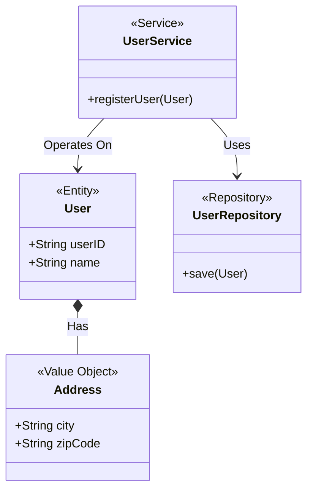
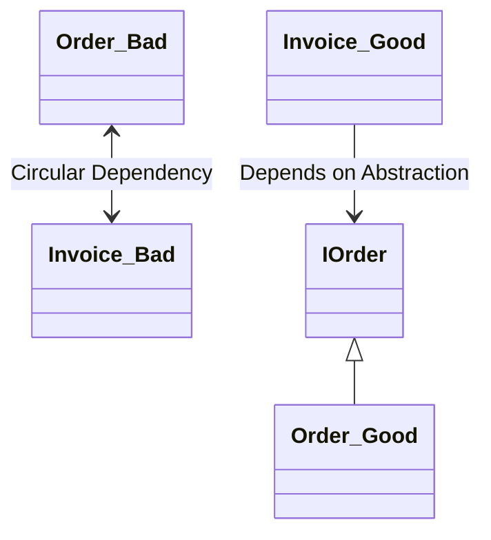

# 02 - Object Design Principles & Advanced Lifecycle

Object design is the discipline of breaking down systems into cohesive, loosely coupled objects. It focuses on giving each object a clear responsibility, strong boundaries, and strict rules about how it lives and dies (lifecycle).

We have combined all **25 Core Topics and Advanced Lifecycle Concepts** into this single, easy-to-read guide. Just like the previous module, this features simple **Hinglish comments** in the C++ code, Mermaid diagrams, and hands-on coding challenges! easy simple way 

---

## Section 1: Responsibility & Domain Modeling

### Topic 01: Identifying Objects
The first step in design is reading the requirements and extracting the natural "nouns" (e.g., `User`, `Cart`, `Payment`, `Order`). These nouns become your objects.

### Topic 02: Identifying Responsibilities
Once you have objects, you must decide what they do. A responsibility is what an object *knows* (its data) and what an object *does* (its methods).

### Topic 03: Assigning Responsibilities (GRASP)
Use patterns like "Information Expert". If an object has the information needed to perform a task, that object should be responsible for performing it. Don't let an outside class calculate things for it.

### Topic 17: Domain Modeling
Translating business rules into code structures. A domain model represents real-world concepts in software.

### Topic 18: Entity vs Value Object
- **Entity**: An object with a unique identity (like a `User` with a User ID). Even if their name changes, they are the same user.
- **Value Object**: An object defined only by its attributes (like a `Date` or `Color`). It has no unique ID. If two dates have the same day/month/year, they are identical.

### Topic 19: Service Objects
A stateless class that orchestrates actions between multiple entities. It does not hold any permanent data itself.

### Topic 20: Repository Concept
A class specifically responsible for saving entities to a database and fetching them back.

### UML Diagram (Domain Modeling)


### Code Example
```cpp
#include <iostream>
#include <string>
#include <memory>

// --- Value Object ---
class Address {
private:
    std::string city;
public:
    Address(std::string c) : city(c) {}
    
    // Value objects only hold data, they don't have a unique ID.
    // Value objects sirf data hold karte hain, inka koi unique ID nahi hota.
    std::string getCity() const { return city; }
};

// --- Entity ---
class User {
private:
    // An Entity is always recognized by its unique ID
    // Entity hamesha apne ID se pehchana jata hai
    std::string userId; 
    Address address;
public:
    User(std::string id, Address addr) : userId(id), address(addr) {}
    std::string getId() const { return userId; }
    std::string getCity() const { return address.getCity(); }
};

// --- Repository (Database interaction) ---
class UserRepository {
public:
    // It is this class's responsibility to save data to the database
    // Database mein save karne ki responsibility iski hai
    void save(const User& user) {
        std::cout << "Saving User: " << user.getId() << " to database.\n";
    }
};

// --- Service (Business Logic) ---
class UserService {
private:
    std::shared_ptr<UserRepository> repo;
public:
    UserService(std::shared_ptr<UserRepository> r) : repo(r) {}
    
    // The Service's job is to control the business flow
    // Service ka kaam hai flow control karna
    void registerNewUser(const User& user) {
        std::cout << "Validating user...\n";
        
        // We tell the repo to save it
        // Repo ko save karne bola
        repo->save(user); 
    }
};

int main() {
    Address addr("Mumbai");
    User u1("U-1001", addr);
    
    auto repo = std::make_shared<UserRepository>();
    UserService service(repo);
    
    // Everything is combined and executed here!
    // Yahan sab combine ho gaya!
    service.registerNewUser(u1); 
    
    return 0;
}
```

### 🎯 Practice Coding Challenges

**Challenge 1: Entity vs Value Object**
- **Goal:** Differentiate between Objects with IDs and Objects with just values.
- **Task:** 
  - Design an `Order` class (Entity). Give it a unique `OrderID`.
  - Design a `Money` class (Value Object). Give it `currency` and `amount`.
  - The `Order` should store a `Money` object representing the total cost.

**Challenge 2: The Repository Pattern**
- **Goal:** Separate database logic from business logic.
- **Task:** 
  - Write an `InMemoryProductRepository` class.
  - Use a `std::vector` or `std::map` inside it to simulate a database.
  - Write methods to `save(Product)` and `findById(string id)`.

**Challenge 3: Stateless Service**
- **Goal:** Create a service that holds no state.
- **Task:** 
  - Create a `DiscountService` class.
  - Add a method `applyDiscount(Cart& cart, string promoCode)`.
  - Ensure the service itself holds no state (it should not have any class-level variables that change when methods are called).

---

## Section 2: Cohesion, Coupling & Dependency

### Topic 05: Cohesion Fundamentals
Cohesion measures how strongly related the responsibilities of a single class are. 

### Topic 07: High Cohesion
A class should have **High Cohesion**. It should do exactly *one* thing really well. If a class is handling database saving, sending emails, and calculating taxes, it has low cohesion.

### Topic 06: Coupling Fundamentals
Coupling measures how strongly different classes depend on each other.

### Topic 08 & 24: Low Coupling & Eliminating Tight Coupling
We want **Low Coupling**. If Class A changes, Class B shouldn't break. We eliminate tight coupling by using Interfaces and Dependency Injection.

### Topic 11: Dependency Management
Managing which class relies on which. You want your outer layers (UI, Database) to depend on your inner layers (Core Business Logic), never the other way around.

### Topic 25: Resolving Circular Dependencies
When Class A depends on Class B, and Class B depends on Class A. You resolve this in C++ by using forward declarations (`class B;`) and Interfaces.

### UML Diagram (Breaking Circular Dependencies)


### Code Example (Breaking Circular Dependency)
```cpp
#include <iostream>
#include <memory>

// We break Circular Dependencies using Interfaces or forward declarations.
// Forward declaration ya Interface se hum Circular Dependency todte hain.
class IEmployee {
public:
    virtual void doWork() = 0;
    virtual ~IEmployee() = default;
};

class Manager {
private:
    // The Manager depends on the Interface, not the concrete class
    // Manager Interface pe depend kar raha hai
    std::shared_ptr<IEmployee> employee; 
public:
    void setEmployee(std::shared_ptr<IEmployee> emp) {
        employee = emp;
    }
    void delegateWork() {
        if (employee) employee->doWork();
    }
};

// The Developer knows who the Manager is, but the Manager only knows the Interface!
// Developer ko pata hai Manager kaun hai, lekin Manager sirf Interface jaanta hai!
class Developer : public IEmployee {
private:
    Manager* myManager; 
public:
    Developer(Manager* mgr) : myManager(mgr) {}
    
    void doWork() override {
        std::cout << "Developer is writing code!\n";
    }
};

int main() {
    Manager boss;
    auto dev = std::make_shared<Developer>(&boss);
    
    boss.setEmployee(dev);
    
    // Loose coupling is achieved successfully!
    // Loose coupling achieve ho gayi!
    boss.delegateWork(); 
    
    return 0;
}
```

### 🎯 Practice Coding Challenges

**Challenge 1: Low Coupling (Constructor Injection)**
- **Goal:** Break hard dependencies.
- **Task:** 
  - You have a `Car` class that creates a `new V8Engine()` directly inside its constructor (Bad! High coupling).
  - Refactor it. Make the `Car` accept an `IEngine` interface from the outside via its constructor.

**Challenge 2: Fix the Cycle (Circular Dependency)**
- **Goal:** Break an `#include` loop.
- **Task:** 
  - Create `Class A` and `Class B` in C++. Make them call methods on each other.
  - Use forward declarations (`class B;`) and pointers/references so the code compiles successfully without circular includes.

**Challenge 3: High Cohesion Check**
- **Goal:** Make classes do exactly one thing.
- **Task:** 
  - Imagine a `UserAccount` class with these 4 methods: `login()`, `logout()`, `sendEmail()`, and `printInvoice()`.
  - Break this single class down into 3 highly cohesive classes, each with its own single responsibility.

---

## Section 3: Boundaries & Behavior

### Topic 04: Encapsulation Boundaries
Shielding internal implementation details from external callers. No outside object should be able to directly modify another object's internal variables.

### Topic 09: Information Hiding
Expose *what* the object does through a clear public contract (interfaces), but hide *how* it does it.

### Topic 10: Programming to Interfaces
Always depend on abstract classes (`IEngine`) rather than concrete implementations (`V8Engine`). This makes swapping out components much easier.

### Topic 14: Tell, Don't Ask
Tell an object what to do, don't ask it for its internal state to make a decision outside of it. It is bad practice to say `if (door.isOpen()) { door.close(); }`. Just say `door.close();` and let the door handle it internally.

### Topic 15: Law of Demeter (LoD)
"Don't talk to strangers." An object should only call methods on:
- Itself
- Objects passed in as parameters
- Objects it directly created
Avoid method chaining like: `a.getB().getC().doSomething()`.

### Code Example (Tell, Don't Ask)
```cpp
#include <iostream>

class Wallet {
private:
    double balance = 100.0;
public:
    // BAD WAY: The caller asks for data and decides what to do externally (Asking)
    // BAD WAY: Caller data maangta hai aur khud decide karta hai (Asking)
    double getBalance() const { return balance; }
    void setBalance(double b) { balance = b; }

    // GOOD WAY: The object manages its own state internally (Telling)
    // GOOD WAY: Object khud apna state manage karta hai (Telling)
    bool deduct(double amount) {
        if (balance >= amount) {
            balance -= amount;
            return true;
        }
        return false;
    }
};

class Customer {
private:
    Wallet myWallet;
public:
    void buyItem(double price) {
        // TELL: "Wallet, deduct this much money."
        // TELL: "Wallet, itne paise deduct karo."
        
        // Don't ask: "Wallet, give me your balance, I will check it, and then set it."
        // Don't ask: "Wallet, apna balance do, main check karunga, fir wapis set karunga."
        if (myWallet.deduct(price)) {
            std::cout << "Item bought for $" << price << "\n";
        } else {
            std::cout << "Not enough money!\n";
        }
    }
};

int main() {
    Customer rahul;
    rahul.buyItem(40.0);
    return 0;
}
```

### 🎯 Practice Coding Challenges

**Challenge 1: Law of Demeter (Don't Talk to Strangers)**
- **Goal:** Prevent deep method chaining.
- **Task:** 
  - You have code doing: `driver.getCar().getEngine().start()`.
  - Refactor the classes so the `Driver` just calls `driver.startCar()`, and the `Car` handles talking to its own engine internally.

**Challenge 2: Tell, Don't Ask**
- **Goal:** Keep logic inside the object that owns the data.
- **Task:** 
  - You have a `Document` with a `bool isPrinted` status. 
  - Outside code is doing: `if (!doc.isPrinted()) { doc.print(); }`
  - Refactor the `Document` class to handle this check internally via a `printDocument()` method.

**Challenge 3: Programming to Interfaces**
- **Goal:** Depend on abstractions, not concretions.
- **Task:** 
  - Create a function `void exportData(IExporter& exporter)`.
  - Do not accept a concrete `CsvExporter`. 
  - Prove it works by passing an `XmlExporter` into the exact same function.

---

## Section 4: Anti-Patterns

### Topic 21: Manager Classes
Manager classes (like `GameManager` or `SessionManager`) are often necessary, but they easily grow out of control. They should ideally act only as lightweight coordinators.

### Topic 22: Avoiding God Objects
A "God Object" is a class that knows everything and does everything. (e.g., a `SystemManager` with 5000 lines of code). You must refactor these by breaking them down into smaller, highly cohesive classes.

### Topic 23: Avoiding Anemic Domain Models
An anemic model happens when your classes are just bags of data (only getters and setters) with zero business logic. In true OOP, data and behavior should sit together inside the same class.

### Code Example (Fixing Anemic Domain Models)
```cpp
#include <iostream>
#include <string>

// --- ANEMIC MODEL (Bad OOP) ---
// This class has no brain, it only holds data.
// Is class ke paas koi dimag nahi hai, sirf data hai.
class AccountAnemic {
public:
    double balance; 
    std::string status;
};

// --- RICH DOMAIN MODEL (Good OOP) ---
// This class holds data AND the logic to control that data.
// Is class ke paas data bhi hai aur usko control karne ka logic bhi.
class AccountRich {
private:
    double balance;
    std::string status;

public:
    AccountRich(double b) : balance(b), status("ACTIVE") {}

    void withdraw(double amount) {
        if (status != "ACTIVE") {
            std::cout << "Account is not active!\n";
            return;
        }
        if (balance >= amount) {
            balance -= amount;
            std::cout << "Withdrew " << amount << ", remaining: " << balance << "\n";
        }
    }

    void freezeAccount() {
        status = "FROZEN";
    }
};

int main() {
    AccountRich acc(500);
    acc.withdraw(100);
    acc.freezeAccount();
    
    // This will fail because the account is frozen; the logic is inside the object!
    // Yeh fail hoga kyunki account frozen hai, logic object ke andar hi hai!
    acc.withdraw(50); 
    
    return 0;
}
```

### 🎯 Practice Coding Challenges

**Challenge 1: Refactor a God Object**
- **Goal:** Break down a massive monolithic class.
- **Task:** 
  - Take a massive `GameManager` class that handles UI, Audio, Player physics, and Enemy AI. 
  - Break it down into smaller classes: `AudioSystem`, `PhysicsEngine`, and `UIManager`.
  - Leave the `GameManager` to just orchestrate them (hold pointers to them).

**Challenge 2: Cure Anemia (Anemic Domain Model)**
- **Goal:** Put behavior back into the data class.
- **Task:** 
  - You have a `ShoppingCart` that only has `vector<Item> getItems()` and `void setItems(...)`. 
  - You have a separate `CartCalculatorService` doing the math.
  - Move the calculation logic (like `calculateTotal()`) directly into the `ShoppingCart` class itself.

---

## Section 5: Advanced Lifecycle, Ownership & DI

### Topic 12: Separation of Concerns
Isolating different parts of your application. Business logic shouldn't care about SQL queries. SQL queries shouldn't care about UI buttons.

### Topic 13: Composition Over Inheritance
Covered in the previous module: Avoid deep inheritance trees. Build classes by combining smaller, flexible components.

### Topic 16: Immutability
Once an object is created, its state cannot be changed (no setter methods). This makes the object incredibly safe to use in multi-threaded environments.

### Object Ownership Models
- `std::unique_ptr`: Strict single ownership. Memory frees automatically.
- `std::shared_ptr`: Shared ownership (reference counted). Memory frees when count hits 0.
- `std::weak_ptr`: Observes a `shared_ptr` without increasing the count (solves cyclic references).

### Dependency Injection (DI) & Pluggable Architecture
Passing dependencies (like database connections or loggers) into a class via its constructor, rather than having the class hard-code their creation. This allows you to "plug in" different implementations dynamically.

### Code Example (Smart Pointers & Dependency Injection)
```cpp
#include <iostream>
#include <memory>

// Interface
class ILogger {
public:
    virtual void log(const std::string& msg) = 0;
    virtual ~ILogger() = default;
};

class FileLogger : public ILogger {
public:
    void log(const std::string& msg) override {
        std::cout << "[File]: " << msg << "\n";
    }
};

class Application {
private:
    // The Application holds unique ownership of the logger
    // Application unique ownership rakhta hai logger ka
    std::unique_ptr<ILogger> logger; 

public:
    // Constructor Injection: We are providing the dependency from the outside!
    // Constructor Injection: Hum bahar se dependency de rahe hain!
    Application(std::unique_ptr<ILogger> l) : logger(std::move(l)) {}

    void run() {
        // When run is called, it uses the internally injected logger
        // Jab run hoga, yeh internally injected logger use karega
        logger->log("Application is starting...");
    }
    
    // As soon as the Application scope ends, the Logger will be deleted automatically!
    // Jaise hi Application ka scope khatam, Logger automatically delete ho jayega!
}; 

int main() {
    // Create the object outside and move it to inject it
    // Bahar object banao aur move karke inject karo
    std::unique_ptr<ILogger> myLogger = std::make_unique<FileLogger>();
    Application app(std::move(myLogger)); 
    
    app.run();
    
    return 0;
}
```

### 🎯 Practice Coding Challenges

**Challenge 1: Immutability**
- **Goal:** Create a read-only object that is thread-safe.
- **Task:** 
  - Create an `RGBColor` class where `r`, `g`, `b` are `const`. Initialize them in the constructor.
  - Provide a method `mix(const RGBColor& other)`. Instead of changing the current color, this method must return a completely *new* `RGBColor` object.

**Challenge 2: Weak Pointers (Breaking Cycles)**
- **Goal:** Prevent memory leaks in shared ownership.
- **Task:** 
  - Create a cyclic reference using two classes `NodeA` and `NodeB` that hold a `std::shared_ptr` to each other.
  - Prove they leak memory (destructors won't print).
  - Change one of the pointers to `std::weak_ptr` and prove the destructors now run correctly.

**Challenge 3: Dependency Injection**
- **Goal:** Inject mock objects for testing.
- **Task:** 
  - Write a `NotificationService` that requires an `IEmailClient`.
  - Create a fake `MockEmailClient` (that just prints to the screen instead of sending real emails).
  - Inject the mock into the service for testing.

---
*This cohesive guide unifies object modeling, advanced lifecycles, and structural C++ design patterns into an interview-ready format.*
