# 03 - UML & Visual System Modeling

Visual modeling (UML) is the universal language of software architecture. Before you write a single line of code, UML helps you draw out the structure and behavior of your system. It's especially critical in 45-minute LLD interviews!

We have combined all **21 UML Topics** into this guide. **Every single topic is explained separately with its own code or diagram!**

---

## Section 1: Structural Diagrams & Visibility

### Topic 01: UML Basics
UML (Unified Modeling Language) has two main types of diagrams: **Structural** (which show how things are built, like the skeleton) and **Behavioral** (which show how things move and interact, like the muscles).

### Topic 02: Class Diagrams
The blueprint. It shows the static structure of the system: classes, their attributes (data), operations (methods), and the relationships between objects.

**UML Diagram (Basic Class):**
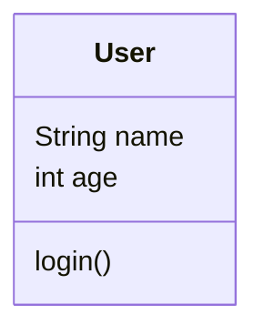

### Topic 03: Object Diagrams
A snapshot of the system at runtime with actual data. Instead of showing the generic `User` class, it shows a specific instance.

**UML Diagram (Object):**
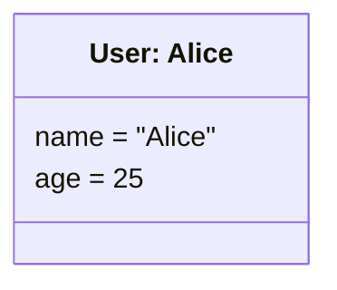

### Topic 07: Package Diagrams
Groups related classes into larger modules or namespaces to show the high-level architecture.

**UML Diagram (Package):**
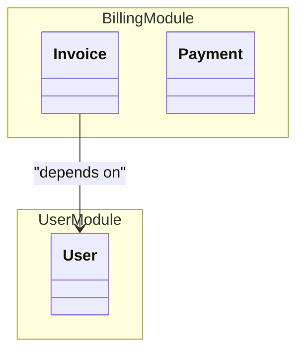

### Topic 08: Class Visibility
In UML class diagrams, visibility determines who can access the data:
- `+` **Public** (Anyone can see it)
- `-` **Private** (Only the class itself can see it)
- `#` **Protected** (The class and its children can see it)
- `~` **Package/Internal** (Visible only within the same namespace)

**UML Diagram (Visibility):**
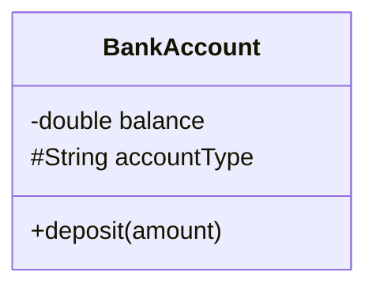

**Code Example:**
```cpp
class BankAccount {
private:
    // '-' in UML
    double balance; 
protected:
    // '#' in UML
    std::string accountType; 
public:
    // '+' in UML
    void deposit(double amount) {} 
};
```

### Topic 09 & 10: Abstract Classes & Interfaces in UML
- **Interface**: A pure abstract class with no data and only pure virtual functions. Marked with the `<<interface>>` stereotype.
- **Abstract Class**: A class that cannot be instantiated but contains some actual logic. Marked by writing the class name in *italics* or adding `{abstract}`.

**UML Diagram:**
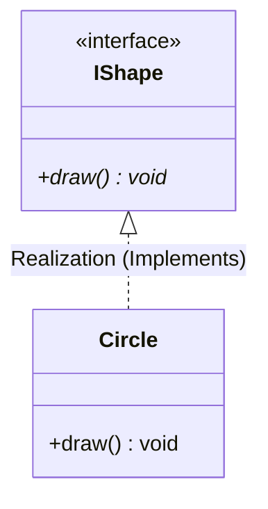

**Code Example:**
```cpp
// <<interface>>
class IShape {
public:
    virtual void draw() = 0; // Pure virtual function (*)
};

class Circle : public IShape {
public:
    void draw() override {}
};
```

### 🎯 Practice Coding Challenges (Section 1)
**Challenge 1: Draw it out**
- **Goal:** Practice writing Mermaid UML syntax.
- **Task:** 
  - Write a Mermaid Class Diagram for a `BankAccount` class.
  - Give it a `private` balance (`-`).
  - Give it a `protected` accountType (`#`).
  - Give it `public` deposit() and withdraw() methods (`+`).

**Challenge 2: Translate to C++**
- **Goal:** Turn UML into real code.
- **Task:** 
  - Convert the `BankAccount` Mermaid diagram you just wrote into a working C++ class.
  - Make sure to use the correct access modifiers in your C++ code.

---

## Section 2: Relationship Semantics & Multiplicity

### Topic 15 & 20: Generalization & Inheritance Relationships
Inheritance (IS-A). Drawn as a solid line with a hollow arrow (`--|>`).

**UML Diagram:**
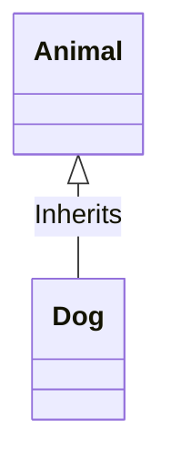
**Code Example:**
```cpp
class Animal {};
class Dog : public Animal {};
```

### Topic 16: Realization
Implementing an Interface. Drawn as a dashed line with a hollow arrow (`..|>`).

**UML Diagram:**
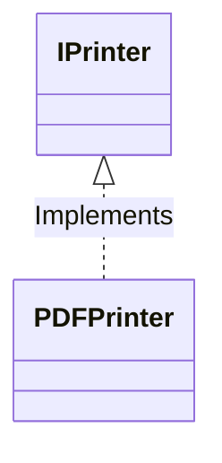
**Code Example:**
```cpp
class IPrinter { virtual void print() = 0; };
class PDFPrinter : public IPrinter { void print() override {} };
```

### Topic 13: Composition
Strong ownership (Strict HAS-A). Drawn as a filled diamond (`*--`). If the parent object is destroyed, the child object is destroyed with it.

**UML Diagram:**
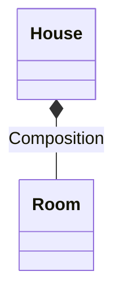
**Code Example:**
```cpp
class Room {};
class House {
private:
    Room myRoom; // Strict ownership
};
```

### Topic 12: Aggregation
Weak ownership (Shared HAS-A). Drawn as a hollow diamond (`o--`). The child object can continue to exist even if the parent is destroyed.

**UML Diagram:**
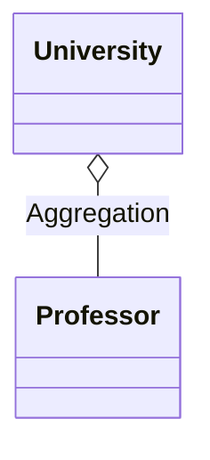
**Code Example:**
```cpp
#include <memory>
class Professor {};
class University {
private:
    std::shared_ptr<Professor> prof; // Weak ownership
};
```

### Topic 11: Association
Direct reference (USES-A). Drawn as a solid line with an open arrow (`-->`). Just means one class knows about another.

**UML Diagram:**
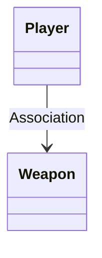
**Code Example:**
```cpp
class Weapon {};
class Player {
public:
    Weapon* myWeapon; // Simply points to a weapon
};
```

### Topic 14: Dependency
Transient usage. Drawn as a dashed line with an open arrow (`..>`). Class A receives Class B as a temporary function parameter.

**UML Diagram:**
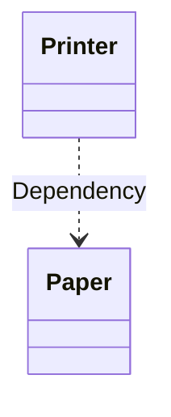
**Code Example:**
```cpp
class Paper {};
class Printer {
public:
    void printDocument(Paper& paper) {} // Transient usage
};
```

### Topic 17, 18, 19: Multiplicity, Navigability, Cardinality Rules
Defines how many objects are involved in a relationship.
- `1`: Exactly one
- `0..1`: Zero or one (optional)
- `*` or `0..*`: Zero or many
- `1..*`: One or many
Navigability (arrows) dictates whether Class A can see Class B, or if it is bidirectional.

### 🎯 Practice Coding Challenges (Section 2)
**Challenge 1: Multiplicity in C++**
- **Goal:** Implement exactly "N" items in a Composition relationship.
- **Task:** 
  - Create a `Library` class that has a strict Composition relationship with exactly `100` `Book` objects.
  - *Hint: Use `std::array<Book, 100>` or a `std::vector` initialized to 100 inside the Library constructor.*

**Challenge 2: UML Mapping**
- **Goal:** Read UML relationship arrows and write the matching code.
- **Task:** Write the C++ code for these two relationships:
  1. `Employee *-- "1" Desk` (Composition: Employee strictly owns 1 Desk).
  2. `Employee ..> CoffeeMachine` (Dependency: Employee temporarily uses a CoffeeMachine).

---

## Section 3: Dynamic Behavioral Modeling

### Topic 04: Sequence Diagrams
Shows how objects interact over time in a step-by-step timeline. Perfect for modeling a single use-case (like "User Login Flow").

**UML Diagram (Sequence Diagram):**
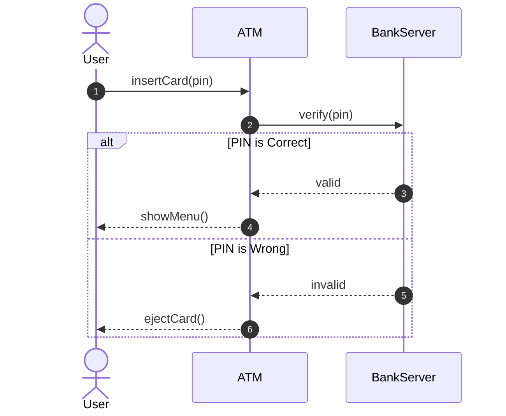

**Code Simulation:**
```cpp
#include <iostream>

class BankServer {
public:
    bool verify(int pin) { return pin == 1234; }
};

class ATM {
private:
    BankServer server; 
public:
    void insertCard(int pin) {
        bool isValid = server.verify(pin); 
        if (isValid) {
            std::cout << "Valid PIN. Showing Menu...\n";
        } else {
            std::cout << "Invalid PIN. Ejecting Card!\n";
        }
    }
};
```

### Topic 05: State Diagrams
Shows how a single object transitions from one state to another based on events (e.g., a Vending Machine going from `IDLE` -> `HAS_MONEY` -> `DISPENSING`).

### Topic 06: Activity Diagrams
Looks like a standard flowchart. Used to show complex workflows, parallel execution branches (fork/join), and decision logic.

### Topic 21: Object Interaction Modeling
Tracing multi-object collaborative scenarios during a specific request. This is the core of LLD whiteboarding (drawing out how the controller talks to the service, which talks to the repository).

### 🎯 Practice Coding Challenges (Section 3)
**Challenge 1: Sequence to Code**
- **Goal:** Turn a timeline into code execution.
- **Task:** 
  - Write a Sequence diagram for logging into a website (`Browser -> AuthAPI -> Database`). 
  - Then write the C++ simulation for it, creating classes for each participant and calling their methods in order.

**Challenge 2: State Machine**
- **Goal:** Implement State Diagram logic.
- **Task:** 
  - Write a C++ `VendingMachine` class.
  - Use an `enum State { IDLE, HAS_MONEY, DISPENSING }`. 
  - Create functions `insertCoin()` and `pressButton()` that use `if/switch` statements to change the machine's state correctly.

---
*This unified guide gives you the visual tools to ace whiteboard interviews, and the C++ knowledge to turn those drawings into actual modern code.*
