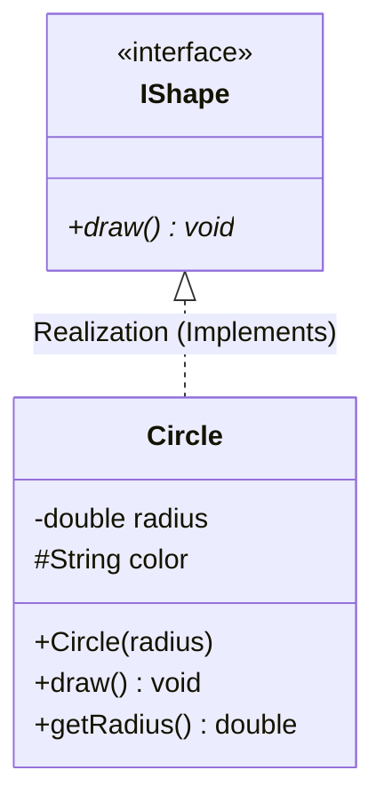
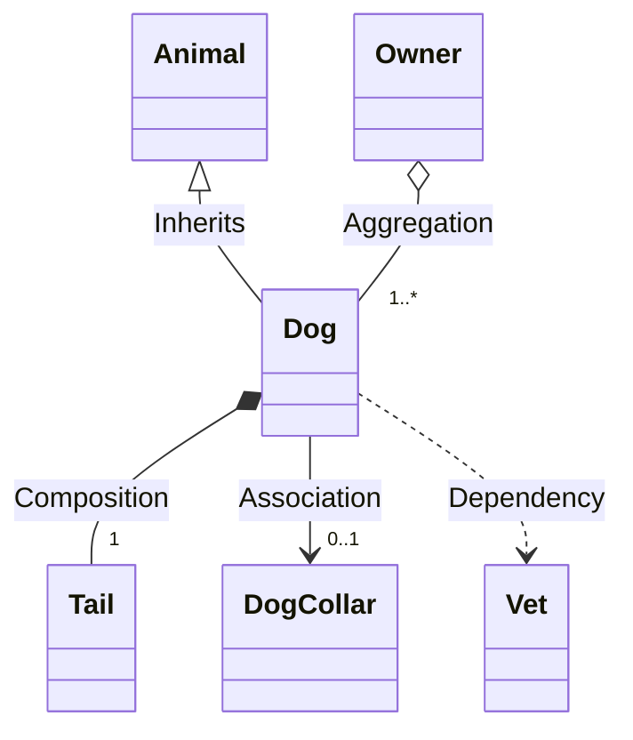
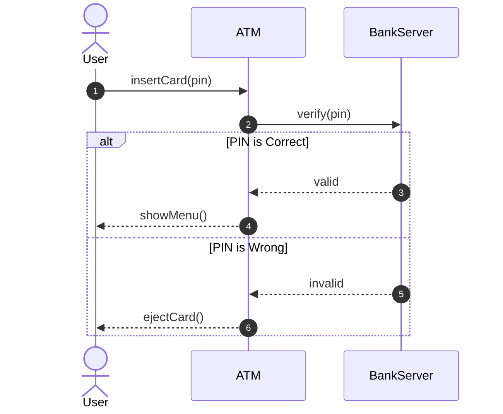

# 03 - UML & Visual System Modeling

Visual modeling (UML) is the universal language of software architecture. Before you write a single line of code, UML helps you draw out the structure and behavior of your system. It's especially critical in 45-minute LLD interviews!

We have combined all **21 UML Topics** into this single, easy-to-read guide. We explain the diagrams, show you the **Mermaid code**, give you the **C++ translation with dual comments (English + Hinglish)**, and provide hands-on challenges! easy simple way

---

## Section 1: Structural Diagrams & Visibility

### Topic 01: UML Basics
UML (Unified Modeling Language) has two main types of diagrams: **Structural** (which show how things are built, like the skeleton) and **Behavioral** (which show how things move and interact, like the muscles).

### Topic 02: Class Diagrams
The blueprint. It shows the static structure of the system: classes, their attributes (data), operations (methods), and the relationships between objects.

### Topic 03: Object Diagrams
A snapshot of the system at runtime with actual data. Instead of showing the generic `User` class, it shows a specific instance like `User: Alice` with `balance = 500`.

### Topic 07: Package Diagrams
Groups related classes into larger modules or namespaces to show the high-level architecture (e.g., `BillingModule` depends on `UserModule`).

### Topic 08: Class Visibility
In UML class diagrams, visibility determines who can access the data:
- `+` **Public** (Anyone can see it)
- `-` **Private** (Only the class itself can see it)
- `#` **Protected** (The class and its children can see it)
- `~` **Package/Internal** (Visible only within the same namespace)

### Topic 09 & 10: Abstract Classes & Interfaces in UML
- **Interface**: A pure abstract class with no data and only pure virtual functions. Marked with the `<<interface>>` stereotype.
- **Abstract Class**: A class that cannot be instantiated but contains some actual logic. Marked by writing the class name in *italics* or adding `{abstract}`.

### UML Diagram (Class Diagram with Visibility)


### C++ Translation
```cpp
#include <iostream>
#include <string>

// Interface (<<interface>> in UML)
// Interface (UML mein <<interface>>)
class IShape {
public:
    // '*' in UML means pure virtual function
    // '*' ka matlab pure virtual function hai
    virtual void draw() = 0; 
    virtual ~IShape() = default;
};

// Circle implements IShape
// Circle IShape ko implement karta hai
class Circle : public IShape {
private:
    // '-' in UML (Private data)
    // '-' in UML (Private data)
    double radius; 
protected:
    // '#' in UML (Protected data, children can access it)
    // '#' in UML (Protected data, bacche access kar sakte hain)
    std::string color; 

public:
    // '+' in UML (Public methods)
    // '+' in UML (Public methods)
    Circle(double r) : radius(r), color("Red") {}

    void draw() override {
        std::cout << "Drawing a circle of radius: " << radius << "\n";
    }

    double getRadius() const { return radius; }
};
```

### 🎯 Practice Coding Challenges

**Challenge 1: Draw it out**
- **Goal:** Practice writing Mermaid UML syntax.
- **Task:** 
  - Write a Mermaid Class Diagram for a `BankAccount` class.
  - Give it a `private` balance (`-`).
  - Give it a `protected` accountType (`#`).
  - Give it `public` deposit() and withdraw() methods (`+`).

**Challenge 2: Translate to C++**
- **Goal:** Turn UML into real code.
- **Task:** 
  - Convert the `BankAccount` Mermaid diagram you just wrote into a working C++ class.
  - Make sure to use the correct `private:`, `protected:`, and `public:` access modifiers in your C++ code.

---

## Section 2: Relationship Semantics & Multiplicity

### Topic 15 & 20: Generalization & Inheritance Relationships
Inheritance (IS-A). Drawn as a solid line with a hollow arrow (`--|>`). If it's too deep, it causes the diamond problem.

### Topic 16: Realization
Implementing an Interface. Drawn as a dashed line with a hollow arrow (`..|>`).

### Topic 13: Composition
Strong ownership (Strict HAS-A). Drawn as a filled diamond (`*--`). If the parent object is destroyed, the child object is destroyed with it.

### Topic 12: Aggregation
Weak ownership (Shared HAS-A). Drawn as a hollow diamond (`o--`). The child object can continue to exist even if the parent is destroyed.

### Topic 11: Association
Direct reference (USES-A). Drawn as a solid line with an open arrow (`-->`). Just means one class knows about another.

### Topic 14: Dependency
Transient usage. Drawn as a dashed line with an open arrow (`..>`). For example, Class A receives Class B as a temporary function parameter.

### Topic 17, 18, 19: Multiplicity, Navigability, Cardinality Rules
Defines how many objects are involved in a relationship.
- `1`: Exactly one
- `0..1`: Zero or one (optional)
- `*` or `0..*`: Zero or many
- `1..*`: One or many
Navigability (arrows) dictates whether Class A can see Class B, or if it is bidirectional.

### UML Diagram (All Relationships)


### C++ Translation
```cpp
#include <iostream>
#include <vector>
#include <memory>

class Animal {};
class Tail {};
class DogCollar {};
class Vet {
public:
    void heal() { std::cout << "Healing the dog!\n"; }
};

// Generalization: Dog IS-A Animal
// Generalization: Dog IS-A Animal
class Dog : public Animal {
private:
    // Composition: Dog owns the Tail strictly. If the Dog dies, the Tail is destroyed!
    // Composition: Dog owns the Tail strictly. Dog marega, Tail bhi khatam!
    Tail myTail; 
    
    // Association: Collar may or may not exist (0..1)
    // Association: Collar ho bhi sakta hai, nahi bhi (0..1)
    std::shared_ptr<DogCollar> collar;

public:
    // Dependency: Vet is just a temporary function argument (Transient)
    // Dependency: Vet siraf function argument mein aya aur gaya (Transient)
    void visitVet(Vet& vet) {
        vet.heal(); // Dog depends on Vet to heal
    }
};

class Owner {
private:
    // Aggregation: Owner has many Dogs (1..*). 
    // Aggregation: Owner ke paas bohot saare Dogs hain (1..*). 
    
    // But if the Owner is deleted, the Dog can still survive!
    // Par Owner agar delete hua, toh Dog zinda reh sakta hai!
    std::vector<std::shared_ptr<Dog>> myDogs;
};
```

### 🎯 Practice Coding Challenges

**Challenge 1: Multiplicity in C++**
- **Goal:** Implement exactly "N" items in a Composition relationship.
- **Task:** 
  - Create a `Library` class that has a strict Composition relationship with exactly `100` `Book` objects.
  - *Hint: Use `std::array<Book, 100>` or a `std::vector` initialized to 100 inside the Library constructor.*

**Challenge 2: UML Mapping**
- **Goal:** Read UML relationship arrows and write the matching code.
- **Task:** Write the C++ code for these two relationships:
  1. `Employee *-- "1" Desk` (Composition: Employee strictly owns 1 Desk).
  2. `Employee ..> CoffeeMachine` (Dependency: Employee temporarily uses a CoffeeMachine passed into a function).

---

## Section 3: Dynamic Behavioral Modeling

### Topic 04: Sequence Diagrams
Shows how objects interact over time in a step-by-step timeline. Perfect for modeling a single use-case (like "User Login Flow").

### Topic 05: State Diagrams
Shows how a single object transitions from one state to another based on events (e.g., a Vending Machine going from `IDLE` -> `HAS_MONEY` -> `DISPENSING`).

### Topic 06: Activity Diagrams
Looks like a standard flowchart. Used to show complex workflows, parallel execution branches (fork/join), and decision logic.

### Topic 21: Object Interaction Modeling
Tracing multi-object collaborative scenarios during a specific request. This is the core of LLD whiteboarding (drawing out how the controller talks to the service, which talks to the repository).

### UML Diagram (Sequence Diagram)


### C++ Translation (Simulating the Sequence Flow)
```cpp
#include <iostream>
#include <string>

// Participant 2
class BankServer {
public:
    bool verify(int pin) {
        // In reality, this would check a database
        // Asliyat mein ye database check karega
        return pin == 1234; 
    }
};

// Participant 1
class ATM {
private:
    // The ATM talks to the BankServer
    // ATM BankServer se baat karta hai
    BankServer server; 
public:
    void insertCard(int pin) {
        std::cout << "Step 1: User inserted card.\n";
        
        // Sequence Diagram Arrow: ATM -> BankServer
        // Sequence Diagram Arrow: ATM -> BankServer
        bool isValid = server.verify(pin); 
        
        // Handling the 'alt' block from the diagram
        // Diagram ke 'alt' block ko handle kar rahe hain
        if (isValid) {
            std::cout << "Step 2 (alt): Valid PIN. Showing Menu...\n";
        } else {
            std::cout << "Step 2 (else): Invalid PIN. Ejecting Card!\n";
        }
    }
};

int main() {
    ATM atm;
    
    // The Actor starts the sequence
    // Actor sequence start karta hai
    atm.insertCard(1234); 
    return 0;
}
```

### 🎯 Practice Coding Challenges

**Challenge 1: Sequence to Code**
- **Goal:** Turn a timeline into code execution.
- **Task:** 
  - Write a Sequence diagram for logging into a website (`Browser -> AuthAPI -> Database`). 
  - Then write the C++ simulation for it, creating classes for each participant and calling their methods in order.

**Challenge 2: State Machine**
- **Goal:** Implement State Diagram logic.
- **Task:** 
  - Write a C++ `VendingMachine` class.
  - Use an `enum State { IDLE, HAS_MONEY, DISPENSING }`. 
  - Create functions `insertCoin()` and `pressButton()` that use `if/switch` statements to change the machine's state correctly according to standard Vending Machine logic.

---
*This unified guide gives you the visual tools to ace whiteboard interviews, and the C++ knowledge to turn those drawings into actual modern code.*
