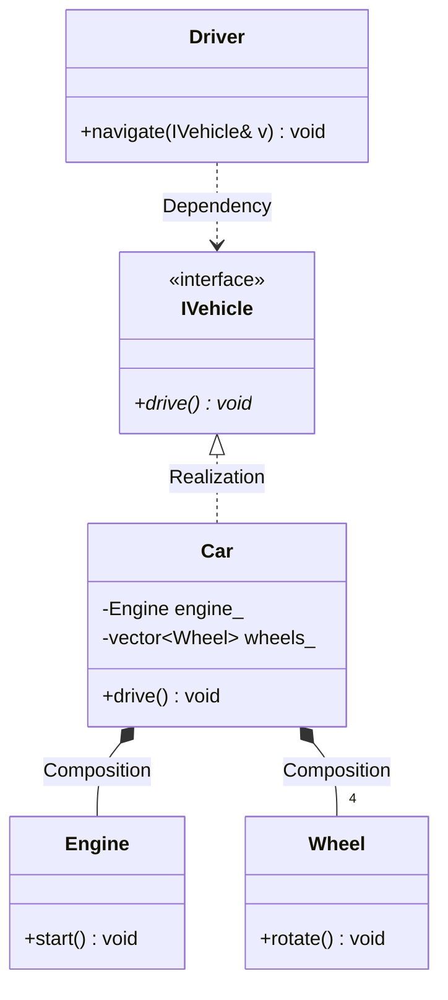
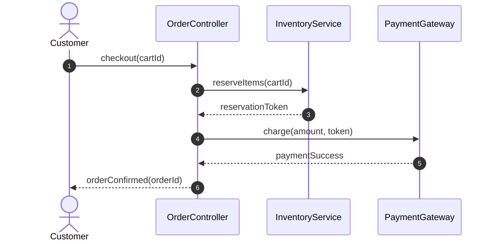

# 03 - UML & Visual System Modeling (21 Topics)

Visual modeling is the universal communication medium in software architecture and technical interviews. It enables candidates and engineers to communicate structural arrangements and dynamic interactions cleanly before writing code.

---

## 🎯 Core Themes in This Module

1. **Static Structural Diagrams**: Class diagrams, object diagrams, package diagrams, and relationship modeling.
2. **Dynamic Behavioral Diagrams**: Sequence diagrams, state diagrams, and activity diagrams.
3. **Relationship Semantics**: Composition, Aggregation, Association, Dependency, Generalization, and Realization.
4. **Interview Whiteboarding**: Rapid sketching techniques for 45-minute LLD interview rounds.

---

## 📋 Comprehensive Topic Roadmap (21 Topics)

| # | Topic | Focus & Diagram Notation |
|:---:|---|---|
| **01** | **UML Basics** | Standard symbols, conventions, structural vs behavioral classification. |
| **02** | **Class Diagrams** | Attributes, operations, visibility annotations, and static contracts. |
| **03** | **Object Diagrams** | Snapshots of concrete instances and their runtime state at a point in time. |
| **04** | **Sequence Diagrams** | Lifelines, message orders, synchronous vs asynchronous calls, return values. |
| **05** | **State Diagrams** | States, events, transitions, guards, entry/exit actions for stateful systems. |
| **06** | **Activity Diagrams** | Workflows, parallel execution branches (fork/join), decisions, and merges. |
| **07** | **Package Diagrams** | Grouping classes into namespaces/modules and mapping module dependencies. |
| **08** | **Class Visibility** | Private (`-`), Protected (`#`), Public (`+`), Package/Internal (`~`). |
| **09** | **Abstract Classes in UML** | Italicized class names or `{abstract}` tag, pure virtual member syntax. |
| **10** | **Interfaces in UML** | `<<interface>>` stereotype or lollipop notation with pure virtual contracts. |
| **11** | **Association** | Solid line with arrow indicating direct navigable reference (`-->`). |
| **12** | **Aggregation** | Hollow diamond (`o--`) representing weak, shared ownership. |
| **13** | **Composition** | Filled diamond (`*--`) representing strong, lifecycle-bound ownership. |
| **14** | **Dependency** | Dashed line with open arrow (`..>`) indicating transient method usage. |
| **15** | **Generalization** | Solid line with hollow triangle (`--|>`) representing class inheritance. |
| **16** | **Realization** | Dashed line with hollow triangle (`..|>`) representing interface implementation. |
| **17** | **Multiplicity** | Specifying cardinality: `1`, `0..1`, `*`, `1..*` on relationship endpoints. |
| **18** | **Navigability** | Determining whether object references are unidirectional or bidirectional. |
| **19** | **Cardinality Rules** | Establishing upper and lower bounds on collections and relationships. |
| **20** | **Inheritance Relationships**| Modeling class hierarchies cleanly to avoid diamond inheritance issues. |
| **21** | **Object Interaction Modeling** | Tracing multi-object collaborative scenarios during request handling. |

---

## 🎨 Visual UML Reference Examples

### Static Class Relationship Hierarchy

### Dynamic Sequence Flow

