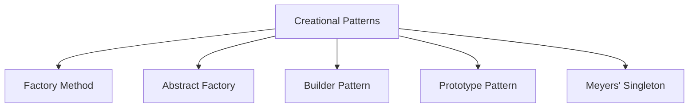

# 05 - Creational Design Patterns in Modern C++

Creational patterns abstract the instantiation process, making systems independent of how their objects are created, composed, and represented.

---

## 🛠️ The 5 Creational Patterns



### 1. Factory Method
Defines an interface for creating an object, but lets subclasses or specialized functions decide which class to instantiate.
- **C++ Idiom**: Return `std::unique_ptr<BaseInterface>`.

### 2. Abstract Factory
Provides an interface for creating families of related or dependent objects without specifying their concrete classes (e.g. GUI widgets for Dark/Light mode or Windows/Linux).

### 3. Builder
Separates the construction of a complex object from its representation, allowing the same construction process to create various representations.
- **C++ Idiom**: Fluent builder chaining returning `*this`, followed by `.build()`.

### 4. Prototype
Specifies the kind of objects to create using a prototypical instance, creating new objects by copying this prototype.
- **C++ Idiom**: Virtual clone idiom: `[[nodiscard]] virtual std::unique_ptr<Base> clone() const = 0;`.

### 5. Thread-Safe Singleton (Meyers' Singleton)
Ensures a class has only one instance and provides a global point of access.
- **C++ Idiom**: Magic Statics (C++11 guaranteed thread-safe static local initialization):
```cpp
class Singleton {
public:
    static Singleton& getInstance() {
        static Singleton instance; // Guaranteed thread-safe in C++11+
        return instance;
    }
    Singleton(const Singleton&) = delete;
    Singleton& operator=(const Singleton&) = delete;
private:
    Singleton() = default;
};
```
