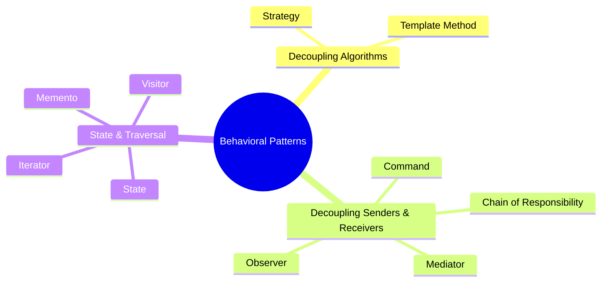

# 07 - Behavioral Design Patterns in Modern C++

Behavioral patterns characterize the ways in which classes or objects interact and distribute responsibility.

---

## 🎭 The 11 Behavioral Patterns

### High-Impact Patterns for LLD Interviews

1. **Strategy Pattern**: Define a family of algorithms, encapsulate each one, and make them interchangeable at runtime.
   - Example: Payment strategies (`CreditCardPayment`, `UPIPayment`, `PayPalPayment`).
2. **Observer Pattern**: Define a one-to-many dependency so that when one object changes state, all its dependents are notified automatically.
   - Example: Event broker, stock ticker, notification dispatch.
3. **State Pattern**: Allow an object to alter its behavior when its internal state changes.
   - Example: Vending machine states (`IdleState`, `HasCoinState`, `DispensingState`).
4. **Command Pattern**: Encapsulate a request as an object, thereby parameterizing clients with different requests, queueing requests, and supporting undoable operations.
   - Example: Transaction log, remote control, text editor undo/redo.
5. **Chain of Responsibility**: Pass requests along a chain of handlers until one handles it.
   - Example: Middleware pipelines, approval workflows, logging filters.
