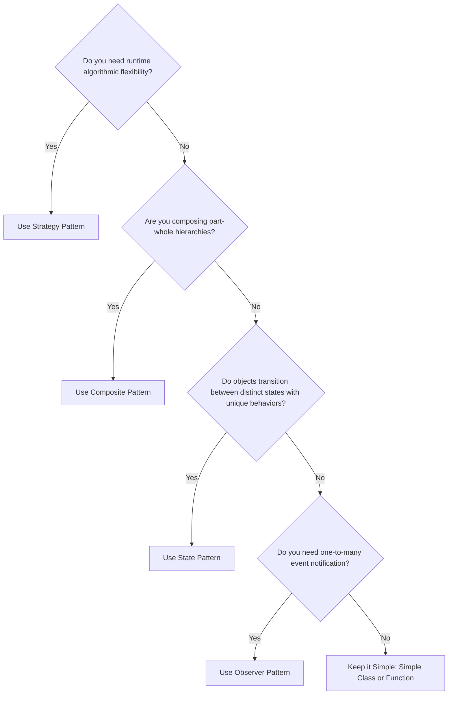

# 08 - Design Pattern Selection & Anti-Overengineering

A critical skill in senior LLD interviews is knowing when **not** to use a design pattern. Premature pattern usage causes unnecessary indirection, cognitive load, and boilerplates.

---

## 🧭 Pattern Selection Decision Framework

---

## ⚖️ Trade-off Matrix

| Requirement | Right Choice | Over-Engineered Trap |
|---|---|---|
| Single creation point with 2 variations | Simple Factory function | Abstract Factory with 5 factory classes |
| Variable configuration parameters | Builder pattern | 15 overloaded constructors |
| Passing a small callback | `std::function` or lambda | Heavyweight Command object hierarchy |
| Notification to 1 subscriber | Direct method call / delegate | Heavyweight Pub/Sub broker |
