# 09 - Low-Level Design (LLD) Systematic Process

Mastering the execution framework to go from an open-ended interview prompt to clean, runnable C++ code in 45 minutes.

---

## ⏱️ The 5-Phase Interview Blueprint

```mermaid
gantt
    title 45-Minute LLD Interview Execution Plan
    dateFormat X
    axisFormat %s min

    section Phase 1: Clarification
    Requirements & Scope Definition       :0, 5
    section Phase 2: Domain Modeling
    Entity Identification & Boundaries    :5, 12
    Class Diagram & Design Patterns       :12, 20
    section Phase 3: Core Implementation
    Clean C++ Code & Interfaces           :20, 37
    section Phase 4: Verification & Concurrency
    Thread Safety & Edge Cases            :37, 42
    section Phase 5: Extensibility
    Future Extensions & Q&A               :42, 45
```

---

## 📝 Step-by-Step Checklist

1. **Clarify Requirements (0-5 min)**:
   - Identify core functional requirements (MVP vs non-MVP).
   - Clarify non-functional constraints (concurrency, scalability, latency).
2. **Identify Entities & Relationships (5-12 min)**:
   - Extract primary domain nouns (e.g. `Slot`, `Ticket`, `Gate`, `Vehicle`).
   - Determine IS-A vs HAS-A relationships.
3. **Draft High-Level Architecture (12-20 min)**:
   - Sketch class hierarchy and designate design patterns (Strategy for pricing, Observer for display).
4. **Implement Clean Modern C++ (20-37 min)**:
   - Write headers/interfaces first (`class ISlotAssignmentStrategy`).
   - Implement domain classes using RAII, smart pointers, and const-correctness.
5. **Thread Safety & Edge Cases (37-45 min)**:
   - Add `std::mutex`, `std::shared_mutex` where race conditions occur.
   - Walk through a complete end-to-end user scenario in `main()`.
