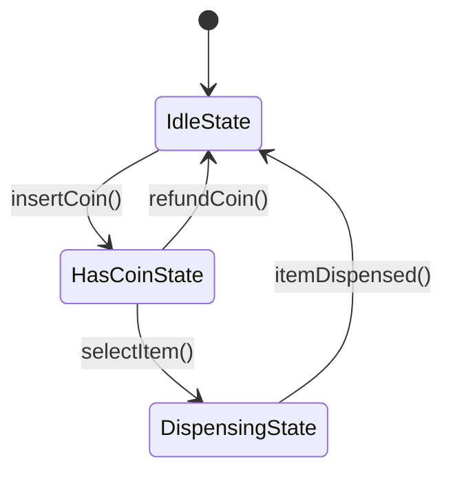

# 10 - State & Behavior Modeling

Many complex systems (vending machines, elevators, order workflows, ATM sessions) transition through explicit state machines. Modeling these cleanly prevents bloated conditionals and bug-prone boolean flag combinations.

---

## 🔄 State Machine Approaches in C++

### 1. Gang-of-Four (GoF) Object-Oriented State Pattern
- Each state is encapsulated in an abstract `State` subclass.
- Context delegates actions to the current state object.
- Easy to add new states without changing the context.



### 2. Modern C++ `std::variant` & `std::visit` (Type-Safe State Machine)
C++17/20 allows modeling states as closed sets of types using algebraic data types:
```cpp
#include <variant>
#include <iostream>

struct Idle {};
struct HasCoin { double amount; };
struct Dispensing { std::string item_id; };

using VendingState = std::variant<Idle, HasCoin, Dispensing>;

void handleEvent(VendingState& state) {
    std::visit([](auto&& s) {
        using T = std::decay_t<decltype(s)>;
        if constexpr (std::is_same_v<T, Idle>) {
            std::cout << "Currently Idle. Waiting for coin.\n";
        } else if constexpr (std::is_same_v<T, HasCoin>) {
            std::cout << "Coin inserted: $" << s.amount << '\n';
        } else if constexpr (std::is_same_v<T, Dispensing>) {
            std::cout << "Dispensing item: " << s.item_id << '\n';
        }
    }, state);
}
```

---

## 🏆 Key Interview Case Studies
- **Vending Machine**: Idle -> HasMoney -> ItemSelected -> Dispensing.
- **Elevator System**: Idle -> MovingUp -> MovingDown -> DoorOpen.
- **Order Life Cycle**: Created -> Paid -> Packaging -> Shipped -> Delivered -> Cancelled.
