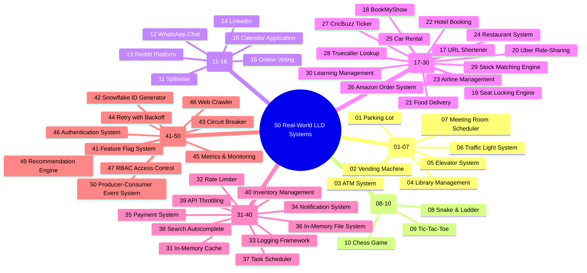

# 14 - Real-World Low-Level Design (LLD) Case Studies (50 Systems)

Real-world case studies evaluate your ability to synthesize Object-Oriented Design principles, Design Patterns, Concurrency Controls, and Clean Code into end-to-end solutions for complex interview problems.

---

## 🧭 Master 50 System Catalog



---

## 1. Core OOP & Real-World Systems (01 – 07)

| # | System | Design Patterns Applied | Key Classes & Entities | Core Technical Challenge |
|---|---|---|---|---|
| **01** | **Parking Lot System** | Strategy (Spot Assignment, Dynamic Pricing), Observer (Display Boards), Factory | `ParkingLot`, `ParkingFloor`, `ParkingSpot` (Compact, Large, EV), `Vehicle`, `Ticket`, `Gate` | Concurrency at entrance/exit gates, multi-floor spot allocation, thread-safe counter. |
| **02** | **Vending Machine** | State Pattern, Chain of Responsibility (Coin/Cash Dispenser) | `VendingMachine`, `State` (`IdleState`, `HasMoneyState`, `DispensingState`, `SoldOutState`), `Inventory`, `Coin`, `Item` | Transaction rollback, exact change computation, atomic inventory decrement. |
| **03** | **ATM System** | State Pattern, Chain of Responsibility (Cash Dispenser Denominations) | `ATM`, `ATMState` (`CardInserted`, `PinEntered`, `TransactionSelected`), `BankService`, `CardReader`, `CashDispenser` | Hardware fault isolation, concurrent account access, transactional rollback on hardware jam. |
| **04** | **Library Management System** | Factory, Observer (Due date alerts), Strategy (Fine Calculation) | `Library`, `Book`, `BookItem`, `Member`, `Librarian`, `Rack`, `LoanRecord`, `ReservationQueue` | Reservation queues with priority, overdue fine calculation, concurrency on high-demand books. |
| **05** | **Elevator System** | State Pattern, Strategy (LOOK, SCAN, Shortest-Seek Dispatch) | `ElevatorController`, `ElevatorCar`, `Button` (Internal/External), `Door`, `DispatchStrategy`, `Direction` | Real-time scheduling optimization, load capacity limits, multi-car coordination. |
| **06** | **Traffic Light System** | State Pattern (Red, Yellow, Green), Observer (Sensors) | `Intersection`, `TrafficLight`, `TrafficController`, `SignalState`, `Sensor` (Vehicle/Pedestrian) | Emergency vehicle override, pedestrian priority buttons, dynamic timing based on vehicle density. |
| **07** | **Meeting Room Scheduler** | Interval Tree / Sweep-Line (Overlap Check), Observer (Invites), Strategy | `Scheduler`, `MeetingRoom`, `Meeting`, `User`, `TimeInterval`, `RoomAllocationStrategy` | Double-booking prevention, recurring meeting scheduling, capacity and amenity matching. |

---

## 2. Games & Simulations (08 – 10)

| # | System | Design Patterns Applied | Key Classes & Entities | Core Technical Challenge |
|---|---|---|---|---|
| **08** | **Snake and Ladder Game** | Strategy (Dice Roll Generator), Observer (State updates) | `Game`, `Board`, `Cell`, `Snake`, `Ladder`, `Dice`, `Player` | Modular cell transitions, customizable board dimensions, fair multi-player turn management. |
| **09** | **Tic-Tac-Toe Game** | Strategy (Winning condition checker), Factory (Player types) | `TicTacToeGame`, `Board`, `Player`, `Piece` (`PieceX`, `PieceO`), `WinStrategy` | $O(1)$ win-check per move on $N \times N$ board, modular Bot vs Human player support. |
| **10** | **Chess Game** | Command Pattern (Move/Undo), Factory (Pieces), Strategy (Validation) | `ChessBoard`, `Cell`, `Piece` (King, Queen, Rook, Bishop, Knight, Pawn), `Move`, `Player` | Move validation rules, check/checkmate detection, move history stack, castling and en passant. |

---

## 3. Social & Communication Apps (11 – 16)

| # | System | Design Patterns Applied | Key Classes & Entities | Core Technical Challenge |
|---|---|---|---|---|
| **11** | **Splitwise (Expense Sharing)** | Strategy (Equal, Exact, Percentage, Shares), Graph Simplification | `SplitwiseService`, `User`, `Group`, `Expense`, `Split`, `BalanceSheet`, `DebtSimplifier` | Graph cycle cancellation (minimizing the total number of transactions across all members). |
| **12** | **Chat Application (WhatsApp-like)** | Observer (Message dispatch), Strategy (Encryption, Media), Producer-Consumer | `ChatServer`, `User`, `Conversation` (1:1, Group), `Message`, `Attachment`, `ReceiptStatus` | Message ordering, offline queuing, delivery status tracking (Sent, Delivered, Read), group fan-out. |
| **13** | **Community Platform (Reddit-like)**| Composite Pattern (Nested Comments Tree), Strategy (Ranking: Hot, Top, New) | `Subreddit`, `Post`, `Comment` (Hierarchical), `User`, `Vote` (Up/Down), `RankingStrategy` | Recursive comment tree rendering, karma calculation, high-throughput voting concurrency. |
| **14** | **LinkedIn (LLD focus)** | Graph Model (Adjacency List), Observer (Activity Feed), Strategy | `Profile`, `Connection`, `ConnectionDegree` (1st, 2nd, 3rd), `Post`, `Job`, `RecommendationEngine` | Bidirectional connection graphs, activity feed fan-out on write vs read, endorsements. |
| **15** | **Calendar Application** | Composite (Recurring Events: Daily, Weekly, RRULE), Observer | `Calendar`, `Event`, `RecurrenceRule`, `Reminder`, `Timezone`, `ConflictChecker` | Timezone transitions, daylight saving time adjustments, recurring event expansion and exceptions. |
| **16** | **Online Voting System** | Command Pattern (Cast Vote), Strategy (Tallying), State | `Election`, `Ballot`, `Candidate`, `Voter`, `Vote`, `AuditLog`, `TallyStrategy` | Anonymity preservation, double-voting prevention, cryptographic audit trail, tamper resistance. |

---

## 4. Platform & Marketplace Apps (17 – 30)

| # | System | Design Patterns Applied | Key Classes & Entities | Core Technical Challenge |
|---|---|---|---|---|
| **17** | **URL Shortener** | Base62 Encoding, Strategy (Hash vs Counter), Cache-Aside | `UrlShortenerService`, `UrlMapping`, `Base62Encoder`, `CacheStore`, `AnalyticsCollector` | Hash collision handling, custom alias validation, high read-to-write ratio ($100:1$), TTL cleanup. |
| **18** | **BookMyShow (Movie Booking)** | Composite (Cinema -> Screen -> Rows -> Seats), Strategy (Pricing) | `Cinema`, `Screen`, `Show`, `Movie`, `Seat` (Silver, Gold, Platinum), `Booking`, `Payment` | Seat matrix representation, dynamic pricing based on demand/time, showtime scheduling. |
| **19** | **BookMyShow Seat Locking** | Optimistic / Pessimistic Locking with TTL Expiration (Timer) | `SeatLockManager`, `SeatLock`, `LockStatus` (Locked, Reserved, Available), `TTLWorker` | Preventing double-booking under concurrent load, auto-release locks upon checkout timeout. |
| **20** | **Uber / Ride Sharing** | Strategy (Driver Matchmaking, Surge Pricing), Observer (Live Location) | `Rider`, `Driver`, `Trip`, `Location`, `MatchingEngine`, `PricingStrategy`, `DispatchService` | Spatial location updates, driver proximity matching, dynamic pricing, trip state lifecycle. |
| **21** | **Food Delivery (Swiggy/DoorDash)**| Observer (Order Tracking), State (Order Lifecycle), Strategy (Routing) | `Restaurant`, `MenuItem`, `Order`, `DeliveryPartner`, `Customer`, `RoutingEngine` | 3-way synchronization (Customer, Restaurant, Courier), delivery time estimation, order cancel window. |
| **22** | **Hotel Reservation System** | Strategy (Seasonal Pricing), Composite (Rooms), Interval Indexing | `Hotel`, `Room`, `RoomType` (Deluxe, Suite), `Reservation`, `PricingEngine`, `DateRange` | Room inventory availability over arbitrary date ranges, group bookings, cancellation refunds. |
| **23** | **Airline Management System** | Strategy (Dynamic Pricing, Baggage), State (Flight Lifecycle) | `Airline`, `Flight`, `FlightInstance`, `SeatMap`, `Passenger`, `Reservation`, `Itinerary` | Multi-leg connecting flights, overbooking thresholds, frequent flyer miles redemption. |
| **24** | **Restaurant Management System** | Observer (Kitchen Display System), State (Table State), Command | `Table`, `Order`, `OrderItem`, `Bill`, `KitchenQueue`, `Menu`, `Waiter` | Table turnaround time, course order sequencing, bill splitting among multiple payment methods. |
| **25** | **Car Rental System** | Strategy (Pricing), Decorator (Insurance, GPS, Child Seats), State | `RentalStore`, `Vehicle` (Sedan, SUV, Truck), `RentalAgreement`, `InspectionReport` | Vehicle status tracking (Available, Reserved, Rented, InMaintenance), return damage logging. |
| **26** | **Amazon Order Management** | State Pattern (Order Lifecycle), Strategy (Tax/Discount), Observer | `Order`, `OrderItem`, `Customer`, `InventoryReserve`, `Payment`, `Shipment`, `Invoice` | Multi-item split shipments, distributed payment capture, inventory reservation rollback. |
| **27** | **CricBuzz (Live Sports Ticker)** | Observer Pattern, State (Match State), Strategy (Run-rate Stats) | `Match`, `Innings`, `Over`, `Ball`, `Player`, `Scorecard`, `Broadcaster` | High-frequency ball-by-ball updates to thousands of observers, commentary log serialization. |
| **28** | **Truecaller (Caller Identification)**| Trie (Prefix Tree) / Hash Index, Strategy (Spam Calculation) | `ContactDirectory`, `TrieNode`, `CallerProfile`, `SpamReport`, `SearchEngine` | Sub-millisecond phone number lookup, prefix auto-complete, community spam voting algorithm. |
| **29** | **Stock Exchange Matching Engine** | Priority Queue (Price-Time Priority), Observer, Command Log | `OrderBook`, `Order` (Limit, Market, StopLoss), `Trade`, `BidQueue`, `AskQueue` | Microsecond matching latency, strict price-time priority execution, partial fill handling. |
| **30** | **Learning Management System (LMS)**| Composite (Course -> Module -> Lesson -> Quiz), State (Progress) | `Course`, `Module`, `Lesson`, `Student`, `Instructor`, `Enrollment`, `Certificate` | Prerequisite validation, progress tracking across mixed media, automated quiz evaluation. |

---

## 5. Infrastructure & Core Systems (31 – 40)

| # | System | Design Patterns Applied | Key Classes & Entities | Core Technical Challenge |
|---|---|---|---|---|
| **31** | **In-Memory Cache System** | Strategy (Eviction: LRU, LFU, FIFO), Reader-Writer Mutex | `Cache<K, V>`, `EvictionPolicy`, `DoublyLinkedList`, `HashMap`, `TTLManager` | $O(1)$ read/write/evict operations, thread-safe reader-writer locking, background TTL eviction. |
| **32** | **Rate Limiter** | Strategy (Token Bucket, Leaky Bucket, Sliding Window Log/Counter) | `RateLimiter`, `RateLimitRule`, `TokenBucket`, `SlidingWindowCounter`, `ClientContext` | Atomic token consumption without lock contention, microsecond evaluation, distributed readiness. |
| **33** | **Logging Framework** | Chain of Responsibility (Log Levels), Singleton, Strategy (Sinks) | `Logger`, `LogLevel`, `LogRecord`, `LogSink` (Console, File, RollingFile), `AsyncAppender` | Async non-blocking logging, lock-free ring buffer, log rotation on file size/date. |
| **34** | **Notification System** | Factory (Notification Types), Strategy (Provider Adapters: SMS, Email, Push) | `NotificationService`, `Notification`, `Channel` (Email, SMS, Push), `PriorityQueue`, `RateGate` | Third-party provider failure fallback, user quiet hours, deduplication, retry with exponential backoff. |
| **35** | **Payment System (LLD)** | Strategy (Payment Methods), Adapter (Gateways: Stripe, PayPal, Razorpay) | `PaymentService`, `PaymentRequest`, `PaymentMethod`, `GatewayAdapter`, `IdempotencyStore` | Idempotent transaction processing, payment state machine, reconciliation ledger. |
| **36** | **In-Memory File System** | Composite Pattern (File and Directory implementing `INode`), Command | `FileSystem`, `INode`, `File`, `Directory`, `PathParser`, `PermissionGuard` | Hierarchical path traversal (`/a/b/c`), recursive deletion, memory usage optimization. |
| **37** | **Task Scheduler / Cron Engine** | Min-Heap Priority Queue, Producer-Consumer Thread Pool, Observer | `TaskScheduler`, `Task`, `CronTrigger`, `WorkerPool`, `PriorityQueue`, `ExecutionRecord` | Accurate delayed execution, recurring interval recalculation, handling missed/delayed tasks. |
| **38** | **Search Autocomplete System** | Trie (Prefix Tree) with Top-K Node Cache, Min-Heap | `AutocompleteService`, `TrieNode`, `SearchRecord`, `FrequencyRanker` | Memory-efficient prefix search, ranking suggestions by search frequency, thread-safe updates. |
| **39** | **API Throttling System** | Decorator / Middleware Interceptor, Strategy (Token Bucket) | `ThrottlingInterceptor`, `ClientQuota`, `QuotaStore`, `PenaltyTracker` | Tiered API client quotas (Free vs Enterprise), burst allowance, sliding window evaluation. |
| **40** | **Inventory Management System** | Observer (Low Stock Alerts), Read-Write Lock, State | `InventoryService`, `Product`, `Warehouse`, `StockAllocation`, `StockAlertListener` | Preventing overselling under concurrent checkouts, multi-warehouse stock reservation. |

---

## 6. Design Patterns & Advanced LLD (41 – 50)

| # | System | Design Patterns Applied | Key Classes & Entities | Core Technical Challenge |
|---|---|---|---|---|
| **41** | **Feature Flag System** | Strategy (Percentage Rollout, Whitelist, Geo), Observer (Rule Updates) | `FeatureFlagManager`, `FeatureToggle`, `TargetingRule`, `UserContext`, `RuleEngine` | Sub-millisecond evaluation, live dynamic rule updates without restarts, sticky bucketing. |
| **42** | **Distributed ID Generator** | Bitwise Masking (Snowflake Algorithm), Thread-Safe Sequence Lock | `IdGenerator`, `SnowflakeId`, `BitAllocator`, `ClockValidator` | Monotonically increasing unique 64-bit IDs, handling clock drift/backwards NTP shifts. |
| **43** | **Circuit Breaker** | State Pattern (`Closed`, `Open`, `HalfOpen`), Proxy Pattern | `CircuitBreaker`, `CircuitState`, `FailureTracker`, `ThresholdPolicy` | Fast-failing degraded downstream services, gradual traffic probing in Half-Open state. |
| **44** | **Retry with Backoff Mechanism** | Strategy (Exponential Backoff with Full Jitter), Decorator | `RetryExecutor`, `BackoffStrategy` (Fixed, Exponential, Jitter), `RetryPolicy` | Preventing thundering herds on recovery via randomized jitter, idempotency checks. |
| **45** | **Metrics & Monitoring System** | Observer / Aggregator, Lock-Free Ring Buffer, Strategy (Exporters) | `MetricsRegistry`, `Counter`, `Gauge`, `Histogram`, `Timer`, `MetricExporter` | Zero-allocation metrics recording, quantile calculation ($p50, p95, p99$), push vs pull export. |
| **46** | **Authentication System** | Chain of Responsibility (Auth Handlers: Token, Basic, OAuth2), Strategy | `AuthService`, `AuthHandler`, `TokenService` (JWT), `UserCredential`, `PasswordHasher` | Secure password hashing (Argon2/Bcrypt), stateless JWT signing & verification, token revocation. |
| **47** | **Role-Based Access Control (RBAC)**| Composite Pattern (Hierarchical Roles: Admin > Editor > Viewer), Flyweight | `AccessController`, `Role`, `Permission`, `User`, `Resource`, `SecurityContext` | Inheritance of permissions through role hierarchies, fine-grained resource-level evaluation. |
| **48** | **Web Crawler (LLD focus)** | Producer-Consumer Thread Pool, Priority Queue (Frontier), Strategy | `WebCrawler`, `UrlFrontier`, `HtmlParser`, `DeduplicationFilter` (Bloom Filter), `RobotsGuard` | Politeness delay per domain, avoiding circular links, high-throughput multi-threaded parsing. |
| **49** | **Recommendation Engine (LLD focus)**| Strategy (Collaborative, Content-Based, Popularity), Pipeline | `RecommendationPipeline`, `RecommenderStrategy`, `ScoringModel`, `CandidateFilter` | Combining multiple recommendation signals with weights, real-time filtering of seen items. |
| **50** | **Event-Driven Producer-Consumer**| Disruptor Pattern / Lock-Free Ring Buffer, Observer (Event Subscribers) | `EventBus`, `RingBuffer`, `Producer`, `Consumer`, `EventSequence`, `BackpressureStrategy` | Lock-free high-throughput event processing, handling slow consumers, fan-out event dispatch. |

---

## 🎯 45-Minute Interview Blueprint for Any System

When presented with any of the 50 systems above during an interview:

```
[0-5 min]   Clarify Requirements: Scope bounds, user actors, MVP features.
[5-12 min]  Extract Entities: Nouns -> Classes, Verbs -> Interfaces/Methods.
[12-20 min] Sketch Architecture: Class diagram, Choose 1-2 GoF patterns that fit.
[20-37 min] Write Clean C++20: Pure interfaces, RAII smart pointers, domain logic.
[37-45 min] Address Edge Cases: Add concurrency locks, discuss scalability & trade-offs.
```
