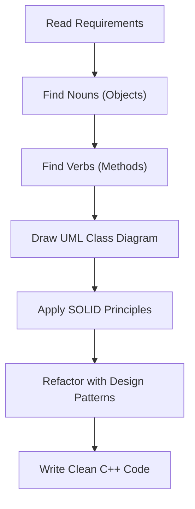

# 🚀 C++ Advanced Low-Level Design (LLD) Masterclass

Welcome to the ultimate, beginner-friendly guide to mastering **Low-Level Design (LLD)** using Modern C++. This repository breaks down complex architecture concepts into simple English, Hinglish, and visual diagrams.

---

## 🤔 What is Low-Level Design (LLD)?
Low-Level Design is the process of breaking down a big software system into smaller, manageable, and highly organized **Objects**. 
While High-Level Design (HLD) focuses on servers, databases, and network architecture, **LLD focuses on the actual code structure, classes, interfaces, and algorithms**.

In simple terms: It is the art of writing code that is easy to read, easy to test, and easy to change in the future without breaking existing features.

---

## 🛠️ How to Approach an LLD Problem?
When you get a problem in an interview (like "Design an ATM" or "Design a Parking Lot"), follow this step-by-step approach:

1. **Clarify Requirements:** Ask questions. What are the core features? What is out of scope?
2. **Identify Core Objects (Nouns):** Find the main entities (e.g., `User`, `Ticket`, `ParkingSlot`).
3. **Identify Behaviors (Verbs):** What do these objects do? (e.g., `User books Ticket`).
4. **Define Relationships:** How do these objects connect? (Composition, Aggregation, Inheritance).
5. **Apply SOLID Principles:** Ensure your classes are decoupled and cohesive.
6. **Apply Design Patterns:** Use standard solutions (like Strategy, Factory, or Observer) for common problems.

### 📊 The LLD Thought Process (Diagram)


---

## 📚 How to Learn from this Repository?

We have structured this repository step-by-step. Each folder contains a detailed `README.md` with theory, Mermaid UML diagrams, dual-language C++ code (English + Hinglish), and 🎯 **Practice Coding Challenges**.

### 📂 Current Curriculum Modules
*Click on a folder to start learning!*

1. **[01 - OOP Foundations & Modern C++ Mechanics](./01-OOP-FOUNDATIONS)**
   - Master Classes, Encapsulation, Polymorphism, Memory Padding, and the Rule of 5.
2. **[02 - Object Design Principles & Lifecycle](./02-OBJECT-DESIGN)**
   - Learn about Cohesion, Coupling, Tell-Don't-Ask, Law of Demeter, and Dependency Injection.
3. **[03 - UML & Visual System Modeling](./03-UML-AND-MODELING)**
   - Master Class Diagrams, Sequence Diagrams, Multiplicity, and Object Interaction.
4. **[04 - SOLID Principles]** *(Coming Soon!)*
5. **[05 - Creational Design Patterns]** *(Coming Soon!)*
6. **[06 - Structural Design Patterns]** *(Coming Soon!)*
7. **[07 - Behavioral Design Patterns]** *(Coming Soon!)*

---

### 💡 Why Simple English & Hinglish?
We believe technical concepts shouldn't be hidden behind complex jargon. All our C++ code blocks feature a unique **double-comment system**:
```cpp
// Composition: The life of Car and Engine are tied together
// Composition: Car aur Engine ki zindagi ek sath judi hai
```
This makes understanding the "why" behind the code much easier for native and bilingual speakers!

Enjoy building beautiful systems! Happy Coding! 🎉