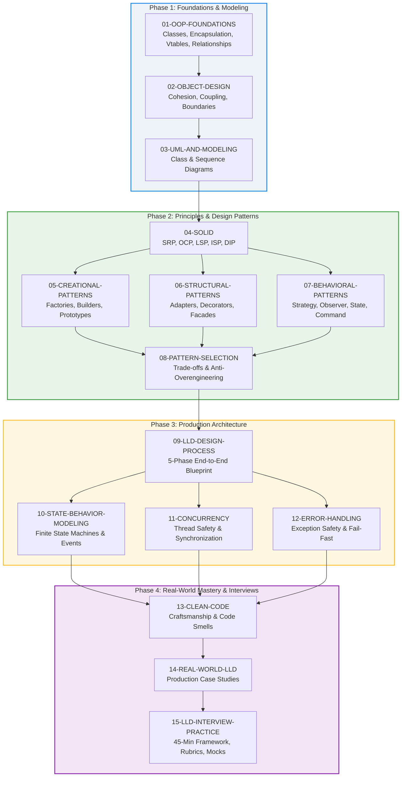

# C++ Advanced Low-Level Design (LLD) Mastery Guide

[](https://en.cppreference.com/)
[](https://cmake.org/)
[](LICENSE)
[](#05-creational-design-patterns)
[](#04-solid-principles)
[](#14-real-world-low-level-systems-50-case-studies)

A production-grade, architectural curriculum for mastering **Low-Level Design (LLD)**, **Object-Oriented Design (OOD)**, **Design Patterns**, and **Software Engineering Best Practices** using **Modern C++ (C++20 / C++23)**.

Designed for senior software engineers, system architects, and candidates preparing for LLD / Machine Coding interviews at top-tier tech companies (FAANG/MAMAA, HFTs, and High-Scale Startups).

---

## 🧭 Curriculum Navigation Map

```
CPP-ADVANCED-LLD/
│
├── README.md                      # Master curriculum, roadmap, and interview framework
├── CMakeLists.txt                 # Modern C++20 CMake root configuration
├── LICENSE                        # MIT License
├── .gitignore                     # Build, IDE, and platform ignore rules
│
├── 01-OOP-FOUNDATIONS/            # Object-oriented paradigm fundamentals & C++ object model
├── 02-OBJECT-DESIGN/              # Cohesion, coupling, Law of Demeter, information hiding
├── 03-UML-AND-MODELING/           # UML 2.5 class diagrams, sequence diagrams, and relationships
├── 04-SOLID/                      # Deep dive into SOLID principles and C++ refactorings
├── 05-CREATIONAL-PATTERNS/        # Factory, Abstract Factory, Builder, Prototype, Meyers' Singleton
├── 06-STRUCTURAL-PATTERNS/        # Adapter, Bridge, Composite, Decorator, Facade, Proxy, Flyweight
├── 07-BEHAVIORAL-PATTERNS/        # Strategy, Observer, Command, State, Template Method, Chain of Resp.
├── 08-PATTERN-SELECTION/          # Pattern vs Pattern tradeoffs, decision trees, anti-overengineering
├── 09-LLD-DESIGN-PROCESS/         # 5-phase systematic LLD blueprint from prompt to production code
├── 10-STATE-BEHAVIOR-MODELING/    # Finite state machines, event-driven reactive models, std::variant
├── 11-CONCURRENCY/                # Thread safety, mutexes, condition variables, reader-writer locks
├── 12-ERROR-HANDLING/             # Exception safety guarantees (basic, strong, nothrow), RAII
├── 13-CLEAN-CODE/                 # Expressive naming, short methods, avoiding code smells
├── 14-REAL-WORLD-LLD/             # Real-world system designs & case studies (Parking Lot, Elevator, etc.)
└── 15-LLD-INTERVIEW-PRACTICE/     # 45-minute interview playbook, communication rubric, mocks
```

---

## 🗺️ Recommended Study Roadmap



---

## ⏱️ The 45-Minute LLD Interview Execution Playbook

In tech interviews, Low-Level Design rounds evaluate structured problem-solving, clean code craftsmanship, and architectural clarity under strict time limits.

```mermaid
gantt
    title Standard 45-Minute LLD Interview Timeline
    dateFormat  m
    axisFormat %M min
    section Clarify & Scope
    Clarify Requirements & Bounds     :a1, 0, 5m
    Actors & Functional Use Cases     :a2, 5, 8m
    section Model & Architecture
    Core Entities & Responsibilities  :b1, 8, 14m
    Class Diagram & Design Patterns   :b2, 14, 20m
    section Implementation
    Interface & Class Skeletons       :c1, 20, 32m
    Core Business Logic & Edge Cases  :c2, 32, 38m
    section Review & Scale
    Concurrency & Exception Safety    :d1, 38, 42m
    Extensibility & Trade-offs Review :d2, 42, 45m
```



### The 6 Golden Rules of C++ LLD Interviews:
1. **Never write code before clarifying requirements**: Agree with the interviewer on what is *in-scope* and explicitly *out-of-scope*.
2. **Prioritize interface contracts**: Define abstract interfaces (`class IStrategy { virtual ~IStrategy() = default; ... };`) before implementing concrete classes.
3. **Prefer modern ownership idioms**: Use `std::unique_ptr` for exclusive ownership, `std::shared_ptr`/`std::weak_ptr` for shared graphs, and `const Type&` / `std::string_view` for read-only observation.
4. **Follow RAII strictly**: Manual resource cleanup (`new`/`delete`, naked mutex unlocks) is an automatic red flag in modern C++.
5. **Separate core logic from storage & presentation**: Avoid mixing database operations, file I/O, or console printing into domain models.
6. **Explicitly articulate design trade-offs**: State why you chose a particular pattern (e.g., *Strategy* vs *State*, *Inheritance* vs *Composition*) and where you deliberately chose not to over-engineer.

---

## 🏛️ Comprehensive Table of Modules

### [01. OOP Foundations](01-OOP-FOUNDATIONS/README.md)
*Core object-oriented principles, C++ memory layout, vtable mechanics, and polymorphic dispatch.*
- Active Implementations:
  - `01-Class-and-Objects` ([Code](01-OOP-FOUNDATIONS/01-Class-and-Objects/class_and_object.cpp) | [Guide](01-OOP-FOUNDATIONS/01-Class-and-Objects/README.md))
  - `02-Access-Modifiers` ([Code](01-OOP-FOUNDATIONS/02-Access-Modifiers/access_modifiers.cpp) | [Guide](01-OOP-FOUNDATIONS/02-Access-Modifiers/README.md))
- Complete 25-topic foundational curriculum covered in [Module 01 Guide](01-OOP-FOUNDATIONS/README.md).

### [02. Object Design Principles](02-OBJECT-DESIGN/README.md)
*Designing robust abstractions, defining boundaries, and mastering cohesion vs coupling.*
- High Cohesion & Low Coupling
- Law of Demeter & Tell Don't Ask
- Information Hiding and Encapsulation Boundaries

### [03. UML and Object Modeling](03-UML-AND-MODELING/README.md)
*Visualizing system architecture with standard UML diagrams and Mermaid specifications.*
- Class Diagrams (Inheritance, Realization, Composition, Aggregation, Association, Dependency)
- Sequence Diagrams for dynamic request workflows

### [04. SOLID Principles](04-SOLID/README.md)
*Mastering Uncle Bob's 5 core design tenets with modern C++ examples and refactorings.*
- Single Responsibility (SRP)
- Open/Closed Principle (OCP)
- Liskov Substitution Principle (LSP)
- Interface Segregation Principle (ISP)
- Dependency Inversion Principle (DIP)

### [05. Creational Design Patterns](05-CREATIONAL-PATTERNS/README.md)
*Decoupling object instantiation and configuring dynamic object creation.*
- Factory Method & Abstract Factory
- Builder Pattern (Fluent API)
- Prototype (Virtual Clone Idiom)
- Thread-Safe Meyers' Singleton

### [06. Structural Design Patterns](06-STRUCTURAL-PATTERNS/README.md)
*Composing classes and objects into larger, flexible structures.*
- Adapter & Bridge (Pimpl Idiom)
- Composite & Decorator
- Facade, Proxy & Flyweight

### [07. Behavioral Design Patterns](07-BEHAVIORAL-PATTERNS/README.md)
*Managing algorithms, object communication, and runtime responsibility assignment.*
- Strategy & State
- Observer & Command
- Chain of Responsibility, Mediator, Template Method

### [08. Pattern Selection & Trade-Offs](08-PATTERN-SELECTION/README.md)
*Evaluating design dilemmas, decision trees, and avoiding pattern overuse.*
- Decision Trees (Strategy vs State, Adapter vs Facade)
- Anti-Overengineering Guidelines

### [09. The LLD Design Process](09-LLD-DESIGN-PROCESS/README.md)
*A structured 5-phase process to navigate from ambiguous prompts to modular code.*
- Requirements Clarification -> Domain Modeling -> Interfaces -> Implementation -> Thread Safety

### [10. State and Behavior Modeling](10-STATE-BEHAVIOR-MODELING/README.md)
*Modeling state machines, event loops, transitions, and business validation rules.*
- Classic OOP State Pattern vs Modern C++ `std::variant` / `std::visit`

### [11. Concurrency in Low-Level Design](11-CONCURRENCY/README.md)
*Thread safety, race prevention, deadlocks, and concurrent resource allocation.*
- `std::mutex`, `std::scoped_lock`, `std::shared_mutex` (Reader-Writer lock)
- Thread-safe caches and booking systems

### [12. Error Handling and Resilience](12-ERROR-HANDLING/README.md)
*Exception safety guarantees, validation strategies, and fail-fast architectures.*
- The 4 Exception Safety Guarantees (Nothrow, Strong, Basic, None)
- Modern C++ Result handling with `std::optional` and `std::expected`

### [13. Clean Code in C++](13-CLEAN-CODE/README.md)
*Best practices for writing self-documenting, maintainable, and readable code.*
- Intent-revealing naming, small focused functions, eliminating code smells

### [14. Real-World Low-Level Systems (50 Case Studies)](14-REAL-WORLD-LLD/README.md)
*50 end-to-end design blueprints across 6 key technical domains:*
- **Core OOP & Systems (01-07)**: Parking Lot, Vending Machine, ATM, Library Management, Elevator, Traffic Light, Meeting Scheduler.
- **Games & Simulations (08-10)**: Snake & Ladder, Tic-Tac-Toe, Chess Game.
- **Social & Communication (11-16)**: Splitwise, WhatsApp Chat, Reddit, LinkedIn, Calendar, Online Voting.
- **Platform & Marketplaces (17-30)**: URL Shortener, BookMyShow, Seat Locking Engine, Uber, Food Delivery, Hotel Booking, Airline Management, Restaurant System, Car Rental, Amazon Order Management, CricBuzz, Truecaller, Stock Exchange Engine, Learning Management System.
- **Infrastructure & Core Systems (31-40)**: In-Memory Cache, Rate Limiter, Logging Framework, Notification System, Payment System, File System, Task Scheduler, Search Autocomplete, API Throttling, Inventory Management.
- **Design Patterns & Advanced LLD (41-50)**: Feature Flags, Snowflake ID Generator, Circuit Breaker, Retry with Backoff, Metrics & Monitoring, Authentication, RBAC, Web Crawler, Recommendation Engine, Event-Driven Producer-Consumer System.
*(Detailed architectural breakdowns, patterns, and challenges available in [14-REAL-WORLD-LLD Guide](14-REAL-WORLD-LLD/README.md)).*

### [15. LLD Interview Practice & Rubric](15-LLD-INTERVIEW-PRACTICE/README.md)
*Mastering live coding interviews, whiteboard modeling, and behavioral communication.*
- Interview Rubrics, 45-Minute Execution Playbook, Mock interview scenarios.

---

## 🛠️ Build and Setup Instructions

### Prerequisites
- Modern C++ Compiler supporting **C++20**:
  - GCC 11+ or Clang 13+ or MSVC 2019+
- **CMake** 3.20 or newer
- **Ninja** or standard build tools (Make, MSBuild)

### Building with CMake

```bash
# 1. Configure the project
cmake -B build -G Ninja

# 2. Build all targets
cmake --build build

# 3. Run foundation targets
./build/bin/lld_01_class_and_objects
./build/bin/lld_02_access_modifiers
```

---

## 📜 License

This project is licensed under the MIT License - see the [LICENSE](LICENSE) file for details.